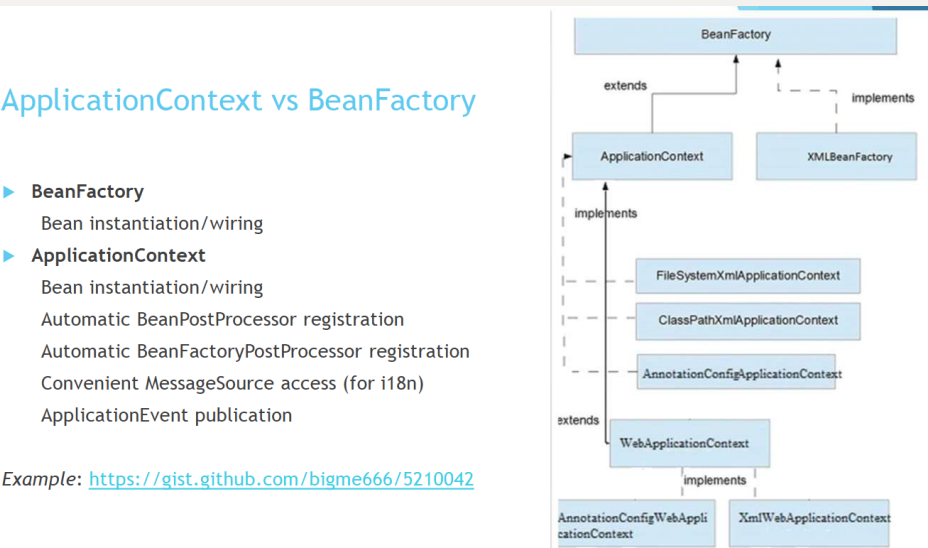
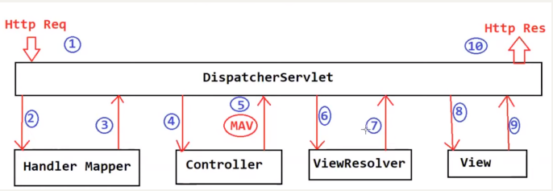

## 1. List all the annotations you learned from class and homework to annotations.md.
Please check `ShortQuestions/annotations.md`.
## 2. What is the @configuration and @bean?
`@Configuration` is an annotation that is used to declare a class as a configuration class. A configuration class is a class that contains bean definitions. 

Bean definitions define the objects that Spring should manage, and the `@Bean` annotation is used to declare a method as a bean definition method within a configuration class.
```java
@Configuration
public class MyConfig {
    
    @Bean
    public MyService myService() {
        return new MyServiceImpl();
    }
    
    @Bean
    public MyController myController() {
        return new MyControllerImpl(myService());
    }
}
```
In this example, `MyConfig` is a configuration class, which is indicated by the `@Configuration` annotation. The `myService()` method is annotated with `@Bean` to indicate that it is a bean definition method that should create a new instance of the MyService interface. Similarly, the `myController()` method is annotated with `@Bean` to indicate that it should create a new instance of the `MyController` interface.

## 3. How do you handle the exception in Spring?
1. `@ExceptionHandler` Annotation: **Method Level**. We can annotate a method with `@ExceptionHandler` to handle the specific exceptions and sending the custom responses to the client.
2. `@ControllerAdvice` Annotation: **Class Level**. We can annotate a class with `@ControllerAdvice` to define global exception handling for the application. This class should contain methods annotated with @ExceptionHandler to handle specific exceptions.


## 4. How do you do the validations in Spring? And list some validation annotations you know.
In Spring, you can do validations by using the validation API and various annotations provided by Spring.

To perform validation, you can add the `@Valid` annotation to the parameter of a method in a Spring controller. This will trigger the validation of the input object, based on the annotations that you add to the fields of that object.

Some of the validation annotations that you can use in Spring are:

* `@NotNull`: used to validate that a field is not null.
* `@NotEmpty`: used to validate that a field is not null and not empty.
* `@NotBlank`: used to validate that a field is not null, not empty, and contains at least one non-whitespace character.
* `@Size`: used to validate that a field's length is within a specific range.
* `@Min`: used to validate that a field's value is greater than or equal to a specified minimum value.
* `@Max`: used to validate that a field's value is less than or equal to a specified maximum value.
* `@Email`: used to validate that a field contains a valid email address.

## 5. What is the actuator?
Spring Boot Actuator is a sub-project of Spring Boot that provides a set of production-ready features to help you **monitor and manage your application**. It exposes several HTTP or JMX endpoints that expose various metrics, health checks, and other operational information about your application. These endpoints allow you to monitor and manage your application in production without the need for external monitoring or management tools.

## 6. watch those videos(泛泛地看⼀遍，能理解多少是多少。没有必要看其它视频)
1. Spring 简介： https://www.youtube.com/watch?v=l0MqsOADAUE&list=PLmOn9nNkQxJFbsU4Qz8CdRiVM4Qs3ci75&index=64  
2. IOC/DI: https://www.youtube.com/watch?v=PyMxNr2p0C0&list=PLmOn9nNkQxJFbsU4Qz8CdRiVM4Qs3ci75&index=65  
3. IOC container: https://www.youtube.com/watch?v=pLa77Tw-yyI&list=PLmOn9nNkQxJFbsU4Qz8CdRiVM4Qs3ci75&index=66  
4. Bean:
   * https://www.youtube.com/watch?v=OpgMHzM7tgQ&list=PLmOn9nNkQxJFbsU4Qz8CdRiVM4Qs3ci75&index=67
   * https://www.youtube.com/watch?v=OpgMHzM7tgQ&list=PLmOn9nNkQxJFbsU4Qz8CdRiVM4Qs3ci75&index=68
   * https://www.youtube.com/watch?v=OpgMHzM7tgQ&list=PLmOn9nNkQxJFbsU4Qz8CdRiVM4Qs3ci75&index=69
5. DI:
   * i. https://www.youtube.com/watch?v=MgTpBST9onM&list=PLmOn9nNkQxJFbsU4Qz8CdRiVM4Qs3ci75&index=70
   * ii. https://www.youtube.com/watch?v=yhEWZx2i1BA&list=PLmOn9nNkQxJFbsU4Qz8CdRiVM4Qs3ci75&index=71


## 7. What is Spring and Springboot? What is the benefits of using Springboot?
**Spring** is a popular Java framework that provides support for building enterprise-level applications. It provides various modules that can be used to develop web applications, RESTful services, data access, security, and more.

**Spring Boot** is a framework built on top of Spring that makes it easy to create stand-alone, production-grade Spring-based applications. It provides a streamlined and opinionated way of building and deploying Spring applications with minimal configuration. Spring Boot offers many benefits, such as:
1. Rapid Application Development - Spring Boot provides a simple and intuitive approach to developing Spring applications, reducing the time and effort required to set up and configure your project.
2. Opinionated Configuration - Spring Boot provides sensible defaults and auto-configuration for many Spring modules, which makes it easy to get started with a project without needing to manually configure everything.
3. Embedded Containers - Spring Boot comes with embedded containers like Tomcat, Jetty, and Undertow, which makes it easy to run and deploy your applications without requiring any external application server.
4. Auto-Configuration - Spring Boot provides a mechanism for auto-configuration, which automatically configures many components and dependencies based on the classpath and the specified conditions.
5. Production-ready - Spring Boot provides various features like health checks, metrics, and monitoring, making it easy to build production-ready applications.
6. Large Community - Spring Boot has a large and active community of developers who contribute to its development, providing support, and developing various libraries and tools.

Spring Benefits
* dependency injection
  * @Autowired
* Inversion of Control

## 8. What is IOC and What is DI?
IOC stands for Inversion of Control, which is a design pattern in software development where the flow of control of a program is inverted or moved away from the programmer and handled by a framework or container. In an IOC container, the responsibility of creating, managing, and injecting dependencies into an application is delegated to the container, rather than being managed by the application code.

Dependency Injection (DI) is a sub-pattern of the IOC pattern. It is a technique used to manage dependencies between objects, allowing for the creation of loosely coupled systems. In DI, the dependencies of an object are injected into it from an external source, rather than being created or managed by the object itself.

## 9. What is @ComponentScan?
`@ComponentScan` is an annotation in Spring that is used to automatically discover and configure the component scanning behavior. By default, Spring will scan the current package and its sub-packages for components, but `@ComponentScan` allows you to specify additional packages to scan. It can be used on any class that has `@Configuration`, `@Component`, `@Repository`, or `@Service` annotation.

When `@ComponentScan` is used, Spring will search for classes in the specified package(s) that have been annotated with `@Component` (or one of its stereotype annotations such as `@Service`, `@Repository`, or `@Controller`) and create instances of those classes as beans in the Spring application context.
```java
@Configuration
@ComponentScan(basePackages = "com.example.myapp")
public class MyAppConfig {
}
```

## 10. How to define which package spring need to scan in xml and annotation?
```xml
<context:component-scan base-package="com.example"/>
```

```java
@ComponentScan(basePackages = "com.example")
```
## 11. What is @SpringbootApplication?
Spring Boot `@SpringBootApplication` annotation is used to mark a configuration class that declares one or more `@Bean` methods and also triggers auto-configuration and component scanning. A single `@SpringBootApplication` annotation can be used to enable those three features, that is:

`@EnableAutoConfiguration`: enable Spring Boot’s auto-configuration mechanism
`@ComponentScan`: enable `@Component` scan on the package where the application is located (see the best practices)
`@Configuration`: allow to register extra beans in the context or import additional configuration classes

## 12. How many ways wo can define a bean?
* **Annotation-based configuration(Class Level)**: In this approach, beans are defined using annotations like `@Component`, `@Service`, `@Repository`, `@Controller`, and `@ContollerAdvice`. These annotations are scanned by Spring and the beans are created automatically.

* **Java-based configuration(Method level)**: In this approach, beans are defined in Java classes annotated with the `@Configuration` annotation. The configuration class contains one or more `@Bean` methods that define the beans.

* **XML-based configuration**: In this approach, beans are defined in an XML configuration file. Each bean is defined as a separate XML element within the file.


## 13. What is default bean name for @Component and @Bean?
The default bean name for `@Component` is the simple class name with the first letter in lower case. For example, if a class is named `MyComponent`, the default bean name will be `myComponent`.

The default bean name for `@Bean` is the method name. For example, if a method is named `myBean`, the default bean name will be `myBean`.

## 14. What is the difference between @Component and @Service, @Repository?
In Spring Framework, `@Component`, `@Service`, and `@Repository` are all stereotypes annotations used to **define a bean**.

1. `@Component` is a generic stereotype annotation used for any class. It is the parent of all stereotypes annotations.
2. `@Service` is a specialization of `@Component` and is used to define a service layer component. Typically, a service is responsible for implementing business logic.
3. `@Repository` is also a specialization of `@Component` and is used to define a DAO (Data Access Object) component. Typically, a repository is responsible for interacting with the database or any other persistent storage.

## 15 How many annotations we can use to inject the bean?
1. `@Autowired`: This is the most commonly used annotation for dependency injection. It automatically injects the dependencies by type.
2. `@Qualifier`: This annotation is used along with @Autowired to specify which bean to inject when there are multiple beans of the same type.
3. `@Resource`: This annotation is used for dependency injection by name. It can be used to inject any resource, not just Spring beans.
4. `@Inject`: This annotation is similar to @Autowired and is used to inject dependencies by type. However, it is not part of the Spring framework and requires an additional library to be used.
## 16. Tell me the three types to do dependency injection(How can we inject the beans in Spring)? Which way is better and why?
1. **Constructor Injection**: In this method, the dependencies are passed to the constructor of the class. This is done by defining the constructor with the required parameters and annotating it with `@Autowired`. Spring will then automatically resolve and inject the required beans when creating an instance of the class.
```java
@Component
public class MyClass {
    private MyDependency myDependency;
    
    public MyClass(MyDependency myDependency) {
        this.myDependency = myDependency;
    }
}
```

2. **Setter Injection**: In this method, the dependencies are injected using setter methods. This is done by defining setter methods for the required dependencies and annotating them with `@Autowired`. Spring will then automatically resolve and inject the required beans by calling the corresponding setter methods.
```java
@Component
public class MyClass {
    private MyDependency myDependency;
    
    @Autowired
    public void setMyDependency(MyDependency myDependency) {
        this.myDependency = myDependency;
    }
}
```
3. **Field Injection**: In this method, the dependencies are injected directly into the fields of the class. This is done by annotating the fields with `@Autowired`. Spring will then automatically resolve and inject the required beans when creating an instance of the class.
```java
@Component
public class MyClass {
    @Autowired
    private MyDependency myDependency;
}
```
## 17. If we have multiple beans for one type, how to set one is primary? and how to let the spring pick one bean to inject if no primary.
If there are multiple beans of the same type, we can use the `@Primary` annotation to specify which bean to use as the primary one. The primary bean will be given precedence when autowiring beans by type.

Priority: @Qualifier > @Primary > By Name > throw exception(NoUniqueBeanDefinitionException)

If we want Spring to pick a bean based on a specific criteria, we can use the `@Qualifier` annotation. Here is an example:
```java
@Service
public class ZooService {
    private final Animal animal;

    public ZooService(@Qualifier("dog") Animal animal) {
        this.animal = animal;
    }

    public void makeAnimalSpeak() {
        animal.speak();
    }
}
```
In this example, we are injecting an `Animal` instance into the `ZooService` constructor. We are specifying that we want the `Dog` bean by using the `@Qualifier("dog")` annotation. If there is no bean with the name "dog", Spring will throw an exception.

## 18. What is the difference between BeanFactory and ApplicationContext in Spring?
1. BeanFactory is a basic container that provides the configuration framework and basic functionality for managing beans, while ApplicationContext is an advanced container that **extends the functionality of BeanFactory with additional features**, such as support for internationalization, event propagation, and the ability to load multiple configurations.
2. BeanFactory uses **lazy loading**, which means that the beans are created only when they are requested, while ApplicationContext uses **eager loading**, which means that all the beans are created when the application context is created.
3. BeanFactory supports only singleton and prototype scopes, while ApplicationContext supports more scopes, such as request, session, and global session.
4. BeanFactory is usually used in resource-constrained environments, such as mobile devices, where memory usage is critical, while ApplicationContext is used in enterprise environments where more advanced features are required.

## 19. What is the Scope of a Bean? and list the examples for each scope.
The scope of a bean defines the lifecycle and visibility of the bean instance.

1. **Singleton**: This is the default scope of a bean. When a bean is configured as a singleton, Spring creates only one instance of the bean, and all requests for the bean will return the same instance. This is useful for stateless beans that can be shared across the application. Example: Database connection objects.
2. **Prototype**: When a bean is configured with a prototype scope, Spring creates a new instance of the bean every time it is requested. This is useful for stateful beans that should not be shared across the application. Example: User session objects.
3. **Request**: A bean with a request scope is created once per HTTP request. This is useful for beans that hold request-specific data, such as form data. Example: Request scoped controllers.
4. **Session**: A bean with a session scope is created once per user session. This is useful for beans that hold user-specific data, such as shopping cart items. Example: Shopping cart objects.
5. **Global Session**: A bean with a global session scope is created once per global HTTP session, and is only available in a Portlet context. Example: Global shopping cart objects.

## 20. Configure a bean using xml. If bean has parameters/dependencies, how can we configure the bean?
In XML configuration, we can configure a bean using the `<bean>` tag. If the bean has dependencies, we can inject those dependencies using constructor or setter injection.

Here is an example of how to configure a bean with constructor injection using XML:

Suppose we have a class `Person` with a constructor that takes two arguments `name` and `age`:
```java
public class Person {
    private String name;
    private int age;

    public Person(String name, int age) {
        this.name = name;
        this.age = age;
    }

    // getters and setters
}
```
To configure a `Person` bean in XML, we can do the following:
```xml
<bean id="person" class="com.example.Person">
    <constructor-arg value="John"/>
    <constructor-arg value="30"/>
</bean>
```
In the above example, we create a bean with the id `person` of type `com.example.Person`. We then use the `<constructor-arg>` tag to inject the `name` and `age` values into the constructor.

If we have a bean with dependencies that can be set through setters, we can use the `<property>` tag to set those values. Here's an example:
```java
public class Employee {
    private String name;
    private String department;

    public void setName(String name) {
        this.name = name;
    }

    public void setDepartment(String department) {
        this.department = department;
    }

    // getters
}
```
To configure an `Employee` bean in XML with setter injection, we can do the following:
```xml
<bean id="employee" class="com.example.Employee">
    <property name="name" value="John"/>
    <property name="department" value="IT"/>
</bean>
```
In the above example, we create a bean with the id `employee` of type `com.example.Employee`. We then use the `<property>` tag to set the `name` and `department` values using setter injection.

## 21. What is MVC pattern?
MVC stands for **Model-View-Controller**. It is a software design pattern commonly used in web applications to separate the application into three interconnected parts: the model, the view, and the controller.

1. The **model** represents the **data** and the **business logic** of the application. It is responsible for managing the data and performing operations on it.
2. The **view** represents the user interface of the application. It is responsible for presenting the data to the user in a meaningful way.
3. The **controller** acts as an intermediary between the model and the view. It receives input from the user and updates the model accordingly. It also updates the view based on changes to the model.

The goal of the MVC pattern is to promote separation of concerns, making it easier to develop and maintain complex applications. By separating the application into distinct components, changes to one component do not affect the others.


Spring Web MVC is the original web framework built on the Servlet API and has been included in the Spring Framework from the very beginning.

### **Controller**  
The front controller maps the incoming request to a controller. Controllers contain the **business logic** of the application. They also handle requests and perform marshalling/ unmarshalling. The function of the controller is to **handle a user request**. The incoming request may be handled in different ways like reading form data, processing it in some way, storing data in a database, or retrieving data from a web service etc. The controller places the data in the model which, simply put, is a container for the data. The controller returns the model (containing data) back to the front controller.

### **Model**
Model is a container for data. It is used to transfer data from one part of the Spring MVC application to another.  
Controller populates the model with data from a form or a database or a web service. As can be seen from the Spring MVC request flow diagram, the controller passes the model to the front controller which forwards it to the view resolver. The view template displays the data in the model.

### View (template)
Spring MVC supports a number of view templates. The most commonly used are JSP or JSTL (JSP Standard Tag Library). Other view templates like Thymeleaf, Groovy, Velocity, and FreeMarker etc., can also be plugged in.  
View template receives the model containing data. It **reads the model and displays the data**. If, say, the model contains a list of players, the view template can create a table to display that list. In most cases a view template is a JSP page that provides data to the user.
## 22. What is Front-Controller?
Front Controller is a design pattern that acts as a centralized request handling mechanism. The pattern **uses a single controller component that handles all incoming requests, delegates them to the appropriate handlers and generates a response**.

In simpler terms, **the Front Controller pattern provides a single entry point for all requests made to a web application**. This controller is responsible for processing the request, deciding which controller or handler should be used to generate the response and dispatching the request to that controller.

The Front Controller pattern has many benefits, including centralizing the handling of requests and reducing code duplication. It also enables more efficient request processing, as the controller can take care of common tasks such as request filtering and authentication.

## 23. What is DispatcherServlet? please describe how it works.
DispatcherServlet is a central component of the Spring MVC web framework. It acts as a front controller, which receives all incoming requests and delegates them to the appropriate handler (controller) for processing.

DispatcherServlet abstracts away the following tedious and boilerplate tasks and focus on useful business logic:
1. Mapping an HTTP request to a certain processing method
2. Parsing of HTTP request data and headers into data transfer objects (DTOs)or domain objects Model-view-controller interaction
3. Generation of responses from DTOs, domain objects, etc.


1. Tomcat receives an `HTTP request` and hands it over to the `DispatcherServlet` for processing.
2. The `DispatcherServlet` takes the request and calls the `HandlerMapper`.
3. The `HandlerMapper` finds the corresponding `Controller` and its corresponding method, and returns it to the `DispatcherServlet`.
4. The `DispatcherServlet` calls the method of the corresponding `Controller`, which triggers the call to the `Service`, `Repository`, and `Database`.
5. The result (`ModelAndView`) is returned by the Controller, typically in the form of a `view name`, such as "list-customers," as a string. The data is set in the `Model`.
6. The `DispatcherServlet` takes the `view name` and calls the `ViewResolver`.
7. The `ViewResolver` helps to find the view template, such as "list-customers.jsp."
8. With the view template and data model available, the View engine is called to help insert the data into the view template and convert it into pure HTML.
9. The resulting HTML is the content displayed in the frontend and is finally returned to the browser.

## 24. What is JSP and What is ModelAndView？
**JSP (JavaServer Pages)** is a technology used for developing web pages that support dynamic content. JSP pages are similar to HTML pages, but they contain Java code snippets that can execute on the server-side, allowing for dynamic content to be generated and displayed based on the user's request.

**ModelAndView** is a class in Spring MVC that represents a model and view to be used by a controller to generate the response. It combines a data model (i.e., the information to be displayed on the web page) with a view (i.e., the presentation layer that generates the HTML, JSP, or other format to display the data). The controller can use the ModelAndView object to set attributes on the model, specify the view to use for rendering the response, and return the object to the DispatcherServlet for processing.

## 25. Could you please google any other servlets(理解多少是多少，不要花太多时间，知道servlet的名字就⾏。)
1. **HttpServlet**: It is the base class for creating HTTP servlets. You can extend this class to handle HTTP requests and responses.
2. **GenericServlet**: It is a generic implementation of the Servlet interface that provides a basic framework for servlets. It is typically used as a superclass for more specific servlet implementations.
3. **Filter**: A servlet filter is an object that intercepts HTTP requests and responses to perform pre-processing and post-processing tasks. It can modify the request or response, or block the request from reaching the servlet.
4. **Listener**: Servlet listeners are used to monitor events in a web application's lifecycle. For example, ServletContextListener can be implemented to perform initialization or cleanup tasks when the application starts or stops.
5. **AsyncContext**: It provides support for asynchronous request processing in servlets. It allows a servlet to suspend the request processing and resume it later, which is useful for long-running tasks or handling multiple requests concurrently.
6. **SessionListener**: Session listeners are used to monitor events related to HTTP sessions, such as session creation, destruction, and attribute changes. They can be used to perform actions based on session events.

## 26. How many web server do you know? (Tomcat, Jetty, Jboss)
1. **Apache Tomcat**: Tomcat is one of the most widely used web servers for Java web applications. It is lightweight, easy to configure, and supports Java Servlet, JavaServer Pages (JSP), and JavaServer Faces (JSF).
2. **Jetty**: Jetty is a lightweight web server and servlet container. It is designed for embedding in applications and provides excellent performance and scalability.
3. **Nginx**: Nginx is a high-performance web server known for its efficiency and low resource consumption. It is commonly used as a reverse proxy server and load balancer.
4. **JBoss** is a popular open-source Java-based application server and web server platform. It is developed by Red Hat and provides a robust and scalable environment for hosting Java applications. JBoss is part of the larger JBoss Enterprise Middleware Suite (JEMS) and is commonly used for deploying enterprise-level applications.
5. **Apache HTTP Server**: Apache HTTP Server, often referred to as Apache, is a powerful and flexible web server. It is highly configurable, supports a wide range of modules, and is used by a significant number of websites.
6. **Microsoft IIS**: Internet Information Services (IIS) is a web server developed by Microsoft for hosting web applications on Windows servers. It provides integration with other Microsoft technologies and supports various protocols and features.
7. **Caddy**: Caddy is a modern, open-source web server that focuses on simplicity and ease of use. It is known for its automatic HTTPS configuration and its ability to easily set up reverse proxy and load balancing.

## 27. clone this repo, and run it in you local.
   a. https://github.com/TAIsRich/springmvc5-demo  
   b. Notice that you need to configure the Tomcat by yourself. tutorial in the slides.  
   c. find out the APIs in controller and call some APIs, In slides, I also list some API.  
   d. remember to create a database for this project  
   e. all details in the slides.

Please check `MavenProject/springmvc5-demo-main`.
