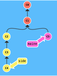

# HW1
## 1. Learn **MarkDownand** show all of basic usage in the *ShortQuestions/README.md*
Please check `ShortQuestions/README.md`
## 2. Practice git and list the command learned
*To recap:*
- commit: a snapshot of the project. Commits are lightweight, switching between them is fast 
- Branch: they are simply pointers to a specific commit 
- Merge: merging in Git creates a special commit that has two unique parents 
- Rebase: rebasing is another way of combining work between branches
  - Merge vs Rebase: merge是合并；rebase是移植将当前分支移植到指定分支上 
  - 通过merge合并的话，会增加一个新的commit，然后将两个分支的历史联系起来；rebase会将整个分支移动到另一个分支上，有效地整合了所有分支上的提交 
  - [Useful links](https://www.51cto.com/article/678181.html)
- Relative ref: 能够更方便的指定提交记录
 - o/main: 是远程仓库的指针，所以它一直指向上次与远程仓库通信时的位置。需要注意，我们本地的 main 还是指向的原来的位置，有需要可自己移动  

*Commands:*
 - `git branch`: use it to create new branch 
 - `git merge`: merge two branches
 - `git rebase`: another way to combine two branches
 - `git checkout main^`: checkout to the parent node of main
   - `git checkout main^^`: checkout to the parent of the parent node of main
   - `git checkout HEAD^`: 也可以将HEAD作为引用参照
   - `git checkout xxx~7`: 后退7步
 - `git branch -f someCommit`: 让分支指向另一个提交
 - `git reset`: 通过把分支记录回退几个提交记录来实现撤销改动
 - `git revert`: reset限本地，revert用以撤销修改并分享给共同使用远程分支的人
 - `git cherry-pick <提交号>`: 将一些提交复制到当前所在的位置（HEAD）下面  
 
 - `git fetch`: 从远程仓库下载本地仓库中缺失的提交记录，并且更新远程分支指针(如 o/main)
   - `git fetch` 并不会改变你本地仓库的状态。它不会更新你的 main 分支，也不会修改你磁盘上的文件
   - 可以将 `git fetch` 的理解为单纯的下载操作
 - `git pull`: 拉取并合并。相当于`git fetch` + `git merge`
 - `git pull –rebase` = `git fetch + git rebase`

## 3. Basic step to init a git repo in local
- Create a directory to contain the project 
- Use cmd to `cd` to this new directory 
- Use cmd and type `git init`
- Do some changes in the project
- Use cmd and type `git add`
- Use cmd and type `git commit`
- Connect to github
  - Create a new repository there
  - Use cmd and type `git remote add origin https://github.com/username/
  repoName`
  - Use cmd and type `git push -u origin master`

## 4. How to clone a repo
- Use cmd `cd` to the location that you want to place the repo
- Copy the url of that repo
- Use cmd and type `git clone url_just_copied`

## 5. How to create a branch and checkout to that branch
- `git branch branch_name`
- `git checkout branch_name  `  
- Or we can use a shortcut to create and checkout to that branch in just one command:  
`git checkout -b branch_name`

## 6. How to merge the branch_test to master branch
- checkout to master branch: `git checkout master`
- merge branch_test to master: `git merge branch_test`

## 7. How to stash new code before leaving branch branch_learn_stash and pop your stash when you checkout back to branch_learn_stash ?
- checkout to branch_learn_stash: `git checkout branch_learn_stash` 
- save the stash: `git stash`
  - better leave a message: `git stash save “save branch_learn_stash”` 
- pop and go back to this branch_learn_stash: `git stash pop` 
  - if we want to use this stash without popping it (we may want to use it several times): `git stash apply`
- to use a specific stash instead of the default one which is at the top of the stash stack:
  - check the # of the stash: `git stash list`
  - `git stash apply stash@{7}`

## 8. How do you understand PR is based on Branch
I cloned someone’s project and made some changes on my own branch. Now if I want to merge this branch to the remote repository where the project locates, I can’t just merge the changes,  I need to inform others about the changes I’ve pushed to a branch into repository. This action of informing others is called Pull Requests. Then we can open this pull request, review the changes with collaborators and leave some commands before my changes are merged to the base branch

## 9. What is Maven?
Maven is a powerful project management tool that is based on POM (project object model). It is used for project build, dependency, and documentation. We can simply say that Maven is a tool that can be used for building and managing any Java-based project.
Maven can help us to do:
1.	We can easily build a project using maven.
2.	We can add jars and other dependencies of the project easily using the help of maven.
3.	Maven provides project information (log document, dependency list, unit test reports, etc.)
4.	Maven is very helpful for a project while updating the central repository of JARs and other dependencies.
5.	With the help of Maven, we can build any number of projects into output types like the JAR, WAR, etc without doing any scripting.
6.	Using maven we can easily integrate our project with a source control systems (such as Subversion or Git).
7.	Maven also helps in managing the project’s build lifecycle, including tasks like compiling, testing, packaging, and deploying the code.
8.	Maven provides a standard project structure, making it easy for developers to understand the layout of the project and locate specific files.

## 10. Maven life cycles
- Prepare-resources: Resource copying can be customized in this phase
- validate: Validates if the project is correct and if all necessary information is available.
- compile: Source code compilation is done in this phase
- Test: Tests the compiled source code suitable for testing framework
- Package: This phase creates the JAR/WAR package as mentioned in the packaging in POM.xml
- Install: This phase installs the package in local/remote maven repository
- Deploy: Copies the final package to the remote repository

## 11. What is the difference between package and install in maven lifecycle ?
- mvn package : take the compiled code and package it in its distributable format, such as a JAR,
- mvn install : install the package into the local repository, for use as a dependency in other projects locally

## 12. Maven plugins
Maven is actually a plugin execution framework where every task is actually done by plugins. Maven Plugins are generally used to:
- create jar file
- create war file
- compile code files
- unit testing of code
- create project documentation
- create project reports  
- 
Maven本质上是一个执行插件的框架。插件共分两类：build插件和reporting插件。
  build插件：会在build阶段被执行，应该配置在POM的<build/>元素中。
  reporting插件：生成站点的时候会执行，应该配置在POM的<reporting/>元素中。
  但所有的插件至少都需要指明：groupId、artifactId、version。  
[Useful links](https://segmentfault.com/a/1190000038973480)

