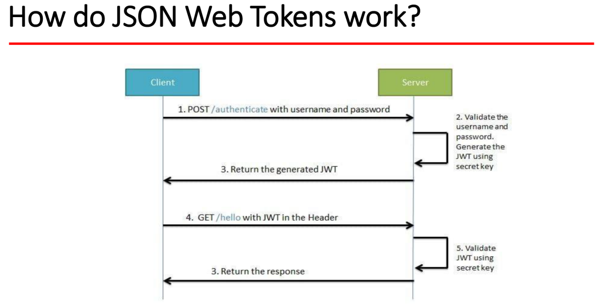

# HW10
## 1. List all the annotations you learned from class and homework to annotations.md
## 2. What is the authentication?
**Authentication** is the process of verifying the identity of a user or system entity **(who are you)**. It ensures that the user or 
entity is who they claim to be before granting access to protected resources or performing certain actions. Authentication is a crucial component of ensuring the security and integrity of a system.

## 3. What is the authorization?
**Authorization** is the process of granting or denying access to specific resources or actions based on the authenticated user's privileges, permissions, or roles. It ensures that authenticated users have appropriate rights and permissions to perform certain operations or access certain resources within a system.

## 4. What is the difference between authentication and authorization?
|   | AUTHENTICATION                                                                                                          | AUTHORIZATION                                                                                                                        |
|---|-------------------------------------------------------------------------------------------------------------------------|--------------------------------------------------------------------------------------------------------------------------------------|
| 1 | In authentication process, the identity of users are checked for providing the access to the system.                    | While in authorization process, person’s or user’s authorities are checked for accessing the resources.                              |
| 2 | In authentication process, users or persons are verified.                                                               | While in this process, users or persons are validated.                                                                               |
| 3 | It is done before the authorization process.                                                                            | While this process is done after the authentication process.                                                                         |
| 4 | It needs usually user’s login details.                                                                                  | While it needs user’s privilege or security levels.                                                                                  |
| 5 | Authentication determines whether the person is user or not.                                                            | While it determines What permission do user have?                                                                                    |
| 6 | Generally, transmit information through an ID Token.                                                                    | Generally, transmit information through an Access Token.                                                                             |
| 7 | Example : Employees in a company are required to authenticate through the network before accessing their company email. | Example : After an employee successfully authenticates, the system determines what information the employees are allowed to access.  |


## 5. What is HTTP Session?
A session is a **server-side** storage mechanism used to maintain state across multiple requests from the same user. When a user logs into a web application or performs an action that requires state management, a session is created on the server. A unique session ID is generated and sent to the client as a cookie or sometimes as a part of the URL.

Sessions are produced and managed by the web server or the web application running on the server. The server associates incoming requests with the correct session using the session ID received from the client.

You cannot directly access session data from the browser, as it is stored on the server. However, you can find the session ID in the browser, either as a cookie or occasionally as a part of the URL, depending on how the web application implements session management.

## 6. What is Cookie?
A cookie is a small piece of data sent from a web server to a user's browser. The browser stores the cookie and sends it back with each subsequent request to the same server. This allows the server to identify and track users and remember their preferences or other data.

Cookies are **produced by the web server** and sent to the client **through HTTP headers**. When a browser receives a cookie, it stores it locally and includes it in future requests to the same server using the "Cookie" header.

You can find cookies in your browser's storage. In most browsers, you can access them through the browser's settings or developer tools under the "Application" or "Storage" tab.

## 7. What is the difference between Session and Cookie?
|            | Session                                 | Cookie                                      |
|------------|-----------------------------------------|---------------------------------------------|
| Definition | Server-side mechanism for maintaining stateful information | Small piece of data stored on the client-side |
| Storage    | Stored on the server                     | Stored on the client-side (in the browser)   |
| Visibility | Not visible or accessible to the client  | Visible and accessible to the client-side    |
| Usage      | Managing user authentication and session-specific data | Storing user preferences, tracking information, etc. |
| Access     | Accessible throughout the session        | Accessible by both client-side and server-side code |
| Mechanism  | Typically managed using cookies, where the Session ID is stored in a cookie | Sent by the server in response headers and stored locally by the client |
| Data       | Private and stored securely on the server | Can store various types of data               |
| Expiration | Session data expires when the session ends | Can have an expiration date for persistence beyond the current session |

## 8. How do we use session and cookie to keep user information across the application?
1. When a user logs in or performs any action that requires user information to be stored, you can **create a session on the server-side** and associate it with the user. The session can be stored in a server-based session storage mechanism.
2. In the session, you can **store user-specific information** such as user ID, username, roles, or any other relevant data. This information will be accessible throughout the session.
3. To **maintain the session**, you can use a **session ID**. This session ID is typically stored in a cookie on the client-side. The server sends the session ID to the client in the response headers, and the client automatically includes it in subsequent requests using the cookie mechanism.
4. On each request, the server can **retrieve the session ID from the cookie sent by the client** and use it to retrieve the corresponding session data. This allows the server to access and use the user information stored in the session.
5. **Cookies** can also be used to **store user-specific information directly on the client-side**. For example, you can store user preferences, language settings, or custom settings in cookies. These cookies will be sent by the client in subsequent requests, allowing the server to access and utilize the stored information.

## 9. What is JWT?
JWT stands for JSON Web Token. It is an open standard (RFC 7519) for securely transmitting information between parties as a JSON object. JWTs are commonly used for authentication and authorization purposes in web applications and APIs.

JWTs consist of three parts: header, payload, and signature. The header contains information about the type of token and the hashing algorithm used for the signature. The payload contains the claims or statements about the user or application, such as user ID, roles, or any other relevant data. The signature is created by encoding the header, payload, and a secret key using the specified hashing algorithm.


## 10. What is the spring security filter?
Spring Security filter is a key component of the Spring Security framework, which provides a layer of security for Spring-based applications. It is responsible for intercepting and processing HTTP requests and responses to enforce security rules and policies.

The Spring Security filter chain is composed of multiple filters that work together to perform various security-related tasks. Each filter has a specific responsibility and performs a specific security function.Some of the commonly used filters in the Spring Security filter chain include:

1. `UsernamePasswordAuthenticationFilter`: This filter handles the authentication process for username and password-based authentication. It intercepts the login requests and validates the credentials.

2. `BasicAuthenticationFilter`: This filter handles Basic Authentication, which is a simple authentication scheme that sends the username and password as Base64-encoded values in the Authorization header.

3. `JwtAuthenticationFilter`: This filter is responsible for validating and processing JWT (JSON Web Token) for token-based authentication. It verifies the token's signature, extracts the user details from the token, and sets the authentication information in the security context.

4. `AuthorizationFilter`: This filter handles the authorization process by checking the user's permissions or roles to determine if they are allowed to access a specific resource or perform a specific action.

5. `CsrfFilter`: This filter protects against Cross-Site Request Forgery (CSRF) attacks by generating and validating CSRF tokens.

6. `LogoutFilter`: This filter handles the logout process by intercepting logout requests and invalidating the user's session.

## 11. Describe how do JWT work

1. **User Authentication**: When a user logs in or authenticates, their credentials are verified by the server. Once the user is authenticated, a JWT is generated.
2. **Token Generation**: The server creates a JWT consisting of three parts: header, payload, and signature.
   * Header: Contains information about the token type (JWT) and the hashing algorithm used for the signature.
   * Payload: Contains claims, which are statements about the user or additional data. Claims can include user ID, roles, expiration time, and other relevant information.
   * Signature: The signature is created by taking the encoded header, encoded payload, and a secret key known only to the server. The signature ensures the integrity and authenticity of the token.
3. **Token Issuance**: The server sends the JWT back to the client as a response to the authentication request.
4. **Token Storage**: The client securely stores the JWT, typically in local storage, session storage, or a cookie. The token is sent along with subsequent requests to the server for authentication and authorization purposes.
5. **Token Verification**: When the client makes a request to a protected resource or API endpoint, it includes the JWT in the request, typically as an Authorization header or within the request payload.
6. **Signature Verification**: The server receives the JWT and validates its authenticity. It verifies the signature by using the same secret key used to generate the token. If the signature is valid, it proceeds with further validation.
7. **Payload Validation**: The server decodes the JWT and extracts the claims from the payload. It checks the expiration time (if specified) to ensure the token is still valid.
8. **User Authorization**: The server verifies the user's identity and checks the claims within the payload to determine if the user is authorized to access the requested resource or perform the requested action. This may involve checking roles, permissions, or any other relevant data stored in the token.
9. **Response**: If the JWT is valid and the user is authorized, the server processes the request and sends back the requested data or performs the requested action.
10. **Token Expiration**: If the JWT has an expiration time and it has expired, the server rejects the request and may require the user to reauthenticate to obtain a new JWT.


## 12. Do you use any Encoder to encode Password?
Spring Security provides several implementations of the PasswordEncoder interface to use password encoders to securely store and compare passwords.

1. `BCryptPasswordEncoder`: This encoder uses the bcrypt hashing algorithm, which is a widely recommended and secure algorithm for password hashing. It automatically generates a random salt and incorporates it into the hash, making it resistant to rainbow table attacks.

2. `PasswordEncoderFactories`: This is a utility class introduced in Spring Security 5 that simplifies the configuration of password encoders. It supports various password storage formats, including bcrypt, SCrypt, and PBKDF2, among others.

3. `NoOpPasswordEncoder`: This is a deprecated encoder that does not perform any encoding or hashing. It should not be used in production as it does not provide any security benefits.

```java
@Configuration
@EnableWebSecurity
public class SecurityConfig extends WebSecurityConfigurerAdapter {

    @Autowired
    private UserDetailsService userDetailsService;

    @Bean
    public PasswordEncoder passwordEncoder() {
        return new BCryptPasswordEncoder();
    }

    @Override
    protected void configure(AuthenticationManagerBuilder auth) throws Exception {
        auth.userDetailsService(userDetailsService).passwordEncoder(passwordEncoder());
    }

    // Other security configurations...
}
```

## 13. What is UserDetailService? AuthenticationProvider? AuthenticationManager? AuthenticationFilter?
1. `UserDetailsService`: The UserDetailsService interface is responsible for retrieving user details from a data source. It is used by Spring Security to load user-specific data during the authentication process. Typically, you would implement this interface to provide user details, such as username, password, and authorities, from your user repository.

2. `AuthenticationProvider`: The AuthenticationProvider interface is responsible for performing authentication against a given set of credentials. It takes an Authentication object (containing the user's credentials) and returns an authenticated Authentication object if the authentication is successful. The AuthenticationProvider can be customized to support various authentication mechanisms, such as username/password authentication or token-based authentication.

3. `AuthenticationManager`: The AuthenticationManager interface is the core component of Spring Security responsible for coordinating the authentication process. It delegates the authentication request to one or more configured AuthenticationProviders. It also determines which AuthenticationProvider should be used based on the type of authentication request. The AuthenticationManager's job is to authenticate the user and return an Authentication object representing the authenticated user.

4. `AuthenticationFilter`: The AuthenticationFilter is a specific type of filter provided by Spring Security. It is responsible for intercepting incoming authentication requests and processing them. The AuthenticationFilter extracts the user's credentials from the request, creates an Authentication object, and passes it to the AuthenticationManager for authentication. The AuthenticationFilter is typically configured in the Spring Security filter chain and acts as the entry point for authentication requests.

To summarize, the **UserDetailsService is responsible for retrieving user details**, the **AuthenticationProvider performs the actual authentication**, the **AuthenticationManager coordinates the authentication process**, and the **AuthenticationFilter handles the incoming authentication requests**.

## 14. What is the disadvantage of Session? how to overcome the disadvantage?
1. **Server resource consumption**: Sessions are stored on the server side, and each active session consumes server memory and resources. This can become a scalability issue if the application has a large number of concurrent sessions.
2. **Session replication and clustering**: When using multiple servers or a clustered environment, session data needs to be replicated or shared across servers, which introduces complexity and additional overhead.
3. **Inflexibility**: Sessions are typically tied to a specific server or application instance. If there is a need to switch servers or scale the application horizontally, session management becomes challenging.
4. Mobile app and API support: Sessions may not be ideal for stateless architectures like mobile apps or APIs, where maintaining session state can be cumbersome and inefficient.

To overcome the disadvantages of session-based approaches, **stateless authentication mechanisms** like JSON Web Tokens (JWT) can be used. JWT is a self-contained token that carries user information and is digitally signed to ensure its integrity. Here are some benefits of JWT:
1. **Scalability**: JWTs are stateless, meaning the server doesn't need to store session data. This makes it easier to scale the application horizontally and reduces the server's memory consumption.
2. **Flexibility**: JWTs can be used in various environments, including mobile apps, single-page applications (SPAs), and APIs. They are not tied to a specific server or session, allowing for more flexibility in architecture.
3. **Improved performance**: With no need for session storage and retrieval, JWT-based authentication can result in improved performance and reduced network overhead.
4. Decentralized authentication: JWTs can be issued by an authentication server and verified by multiple services or applications without relying on a centralized session store.

## 15. How to get value from application.properties?
1. Using the `@Value` annotation:
```java
@Value("${property.key}")
private String propertyValue;
```
In the above example, replace `property.key` with the key of the property you want to retrieve from the `application.properties` file. Spring will automatically inject the corresponding value into the `propertyValue` variable.

2. Using the `Environment` object:
```java
@Autowired
private Environment environment;

public String getPropertyValue() {
    return environment.getProperty("property.key");
}
```
In this approach, autowire the `Environment` object and use the `getProperty` method to retrieve the value associated with the specified key.

## 16. What is the role of configure(HttpSecurity http) and configure(AuthenticationManagerBuilder auth)?
In Spring Security, `configure(HttpSecurity http)` and `configure(AuthenticationManagerBuilder auth)` are methods that you can override in a class that extends `WebSecurityConfigurerAdapter`. These methods play a crucial role in configuring the security settings and authentication mechanisms for your application.

1. `configure(HttpSecurity http)`: This method is responsible for configuring the security aspects related to HTTP requests. It allows you to define the access rules, authentication requirements, and other security configurations.    

   For example, you can specify which URLs require authentication, define role-based access control, enable form-based or token-based authentication, configure session management, enable CSRF protection, and more. You can use various methods provided by the `HttpSecurity` object to customize the security behavior based on your application's requirements.

2. `configure(AuthenticationManagerBuilder auth)`: This method is used to configure the authentication mechanism for your application. It allows you to define how Spring Security should verify the identity of users and authenticate them.

   You can specify the authentication providers, such as in-memory authentication, JDBC-based authentication, LDAP authentication, or custom authentication mechanisms. You can also define user details services, password encoders, and other authentication-related settings.

   For example, you can configure an authentication provider to use a database for user authentication, specify the queries to retrieve user details and authorities, set up password encoding for secure storage and validation, and more.


## 17. What is Spring security authentication and authorization?
Authentication: Authentication is the process of verifying the identity of a user or entity. In Spring Security, authentication involves validating the user's credentials, such as username and password, to ensure that the user is who they claim to be. Spring Security offers various authentication mechanisms, including in-memory authentication, database-based authentication, LDAP authentication, OAuth, and more. It provides the necessary infrastructure to handle authentication requests, authenticate users, and establish their identities within the application.

Authorization: Authorization is the process of granting or denying access to certain resources or functionalities based on the authenticated user's permissions. Once a user is authenticated, Spring Security allows you to define access control rules and permissions to restrict or grant access to specific parts of your application. This can be done using role-based access control (RBAC), where users are assigned roles, and each role has a set of permissions. Spring Security provides annotations, configuration options, and expressions to implement fine-grained authorization rules and enforce access control based on user roles, permissions, or other attributes.

## 18. 
Assuming that the Redbook UI supports dark mode and multiple languages, when a user signs in, their preferences 
(such as dark-mode=true and lang=eng) will be read from the database. For the assignment, you can set a value like in the course materials; there is no need to actually read from a database. After signing in, observe the response header and cookie for related information. Continue calling other APIs and observe the request header or cookie for other information. After signing in, Spring Security will generate a session, and the JSESSIONID will be in the cookie. Try to obtain the session content through the JSESSIONID, and then log the session content using the log4j tool. Write the code based on the 08_04 branch.
