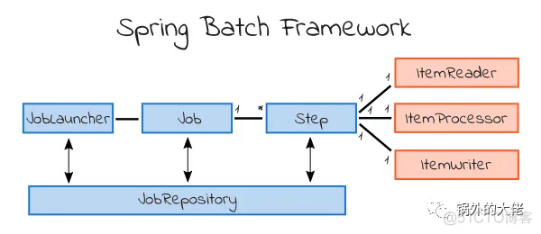

# hw 11

## 1. List all of the annotations you learned from class and homework to annotations.md
## 2. Briefly reading: https://www.techgeeknext.com/spring-boot/spring-aop-interview-questions

## 3. What is the Aspect Oriented Programming?
Aspect-Oriented Programming (AOP) is a programming paradigm that aims to modularize cross-cutting concerns in software systems. In traditional object-oriented programming, concerns such as logging, transaction management, security, and caching are often scattered across different components and tangled with the core business logic. AOP provides a way to separate these concerns and encapsulate them into reusable modules called aspects.

The key concepts in AOP are:
1. Aspect: An aspect encapsulates cross-cutting concerns and provides reusable modules of functionality.
2. Join Point: A join point represents a point in the execution of the program, such as method invocation or exception handling.
3. Pointcut: A pointcut is a predicate that matches join points. It specifies the locations in the program where the aspect's advice should be applied.
4. Advice: Advice is the code that is executed at a particular join point. It represents the functionality provided by the aspect.
5. Weaving: Weaving is the process of applying aspects to the target objects or the target code at the specified join points.
6. 
## 4. What are the advantages and disadvantages of Spring AOP?

Advantages of Spring AOP:
1. Modularity: Spring AOP allows you to modularize cross-cutting concerns, such as logging, security, and transaction management, into separate aspects. This improves code organization and reusability.
2. Code Reusability: Aspects can be applied to multiple parts of the system, reducing code duplication. This promotes code reusability and maintainability.
3. Separation of Concerns: AOP enables the separation of cross-cutting concerns from the core business logic, making the codebase more maintainable and easier to understand.
4. Declarative Approach: Spring AOP supports a declarative programming style, where you can specify aspects and their pointcuts using annotations or XML configurations. This simplifies the aspect configuration and reduces the amount of boilerplate code.
5. Integration with Spring Framework: Spring AOP seamlessly integrates with other Spring features, such as dependency injection and transaction management. This provides a cohesive and consistent framework for building enterprise applications.

Disadvantages of Spring AOP:
1. Limited to Method-Level Interception: Spring AOP is primarily focused on method-level interception. It may not be suitable for intercepting other types of join points, such as field access or object creation. For more advanced interception scenarios, you may need to use other AOP frameworks like AspectJ.
2. Proxy-Based Approach: Spring AOP uses dynamic proxies to implement aspect-oriented behavior. This means that it can only intercept method calls on Spring-managed beans and not on objects obtained from external dependencies. This limitation may require additional configuration or usage of AspectJ if you need to intercept external dependencies.
3. Limited Support for Compile-Time Weaving: Spring AOP primarily uses runtime weaving, which may have a slight performance impact compared to compile-time weaving. However, Spring AOP can be used with AspectJ for more advanced weaving scenarios.
4. Limited Aspect Composition: Spring AOP provides limited support for aspect composition, where multiple aspects are combined to form a single aspect. If you have complex aspect composition requirements, you may need to use AspectJ, which provides more advanced composition features.

## 5. What is Aspect in Spring AOP?
Aspect(class to define all aop self methods): a modularization of a concern that cuts across multiple classes. Transaction management is a good example of a crosscutting concern in enterprise Java applications. In Spring AOP, aspects are implemented using regular classes or regular classes annotated with the @Aspect annotation.

## 6. What is Pointcut in Spring AOP?
Pointcut: a predicate that matches join points. Advice is associated with a pointcut expression and runs at any join point matched by the pointcut (for example, the execution of a method with a certain name). The concept of join points as matched by pointcut expressions is central to AOP, and Spring uses the AspectJ pointcut expression language by default.

Expression to find all main application methods to insert advice
## 7. What is the Join point in Spring AOP?
Join point: a point during the execution of a program, such as the execution of a method or the handling of an exception. In Spring AOP, a join point always represents a method execution.


## 8. What does it mean by Advice and its types in Spring AOP?
Advice: action taken by an aspect at a particular join point. Different types of advice include "around," "before" and "after" advice. (Advice types are discussed below.) Many AOP frameworks, including Spring, model an advice as an interceptor, maintaining a chain of interceptors around the join point.

Advice: before/after/around/afterThrowing - When to execute aop methods when the application pointcut is found.
* @Before – Run before the method execution
* @After – Run after the method returned a result
* @AfterReturning – Run after the method returned a result, intercept the returned result as well.
* @AfterThrowing – Run after the method throws an exception
* @Around – Run around the method execution, combine all three advices above.
* @Aspect - indicate this is a aop class
* @Component - This annotation mark the beans as Spring’s managed components
* @Before annotated methods run exactly before all methods matching with pointcut expression

## 9. Reading: https://www.javainuse.com/spring/sprbatch_interview
## 10. When to use Spring Batch?
Spring Batch is a powerful framework for batch processing in Java applications. It provides a set of reusable components and patterns to facilitate the development of batch processing workflows.

1. Large Data Processing: When you need to process a large volume of data, such as batch data updates, data imports, or data exports, Spring Batch can efficiently handle the processing of large datasets.
2. Scheduled Jobs: If you have recurring tasks or scheduled jobs that need to be executed at specific times or intervals, Spring Batch provides built-in support for scheduling and executing batch jobs based on cron expressions or fixed intervals.
3. Data Transformation and Integration: Spring Batch is suitable for scenarios where you need to transform, validate, or integrate data from multiple sources. It provides facilities to read data from various sources, process it, and write the transformed data to different destinations.
4. Fault Tolerance and Retry Mechanisms: Batch processing often involves handling errors, retries, and fault tolerance. Spring Batch provides mechanisms for handling exceptions, retrying failed steps or processes, and implementing fault-tolerant batch workflows.
5. Transactional Processing: If your batch processing requires transactional integrity, Spring Batch integrates seamlessly with Spring's transaction management capabilities. It ensures that the entire batch job is executed within a single transaction, allowing for atomicity and consistency of the data.
6. Monitoring and Management: Spring Batch provides extensive monitoring and management features, including job execution statistics, progress tracking, job restartability, and error handling. These features enable easy monitoring and management of batch jobs in production environments.
## 11. How Spring Batch works?

1. Define Job Configuration: In Spring Batch, you start by defining the configuration for your batch job. This configuration includes steps, readers, writers, processors, and other components necessary for the job execution. You typically define this configuration using XML or Java-based configuration.
2. Create Job Steps: A batch job consists of one or more steps. Each step represents a specific task or processing unit within the job. Steps can be sequential or parallel, depending on the requirements. For each step, you define a reader to fetch data, a processor to transform or process the data, and a writer to store the processed data.
3. Read-Process-Write Cycle: During the job execution, Spring Batch follows the read-process-write cycle. The reader component reads data from a data source, such as a database, file, or web service. The processor component performs any required business logic or data transformation on the read data. Finally, the writer component writes the processed data to the desired destination, such as a file, database, or message queue.
4. Chunk-Based Processing: Spring Batch uses a chunk-based processing model, where a configurable number of items (known as a chunk) is read, processed, and written at a time. This approach improves performance by reducing database or I/O operations and optimizing memory usage.
5. Transaction Management: Spring Batch integrates with Spring's transaction management capabilities. It ensures that the entire batch job or individual steps are executed within a transaction. This allows for atomicity and consistency of the data and provides transactional integrity during batch processing.
6. Error Handling and Retry: Spring Batch provides mechanisms for handling errors and retries during batch processing. It allows you to define error handling strategies, such as skipping or retrying failed items, logging errors, or stopping the job on critical errors. You can configure the retry count and backoff policies for failed items.
7. Job Scheduling: Spring Batch offers built-in support for job scheduling. You can schedule batch jobs to run at specific times or intervals using cron expressions or fixed intervals. This allows for the automation of recurring batch tasks.
8. Monitoring and Management: Spring Batch provides extensive monitoring and management features. It offers job execution statistics, progress tracking, job restartability, and error handling capabilities. You can monitor and manage batch jobs through the Spring Batch Admin UI or programmatically using the provided APIs.

## 12. How can we schedule a Spring Batch Job?
```java
@Configuration
@EnableScheduling
public class BatchJobScheduler {
    
    @Autowired
    private JobLauncher jobLauncher;
    
    @Autowired
    private Job myJob;
    
    @Scheduled(cron = "0 0 0 * * ?")
    public void runJob() throws JobParametersInvalidException, JobExecutionAlreadyRunningException,
            JobRestartException, JobInstanceAlreadyCompleteException {
        JobParameters jobParameters = new JobParametersBuilder().addDate("date", new Date()).toJobParameters();
        jobLauncher.run(myJob, jobParameters);
    }
}
```
In this example, the `runJob()` method is scheduled to run at midnight (0 hours) every day. It uses the `JobLauncher` to launch the specified `myJob` with the given `JobParameters`.

## 13. What is the cron expression?
A cron expression is a string that represents a schedule or a time-based pattern used in scheduling tasks. It is widely used in various systems, including cron jobs, task schedulers, and cron-like scheduling libraries.

A cron expression consists of fields that specify individual time elements, such as seconds, minutes, hours, days of the month, months, and days of the week. Each field has a specific range or set of values that determine when a task should be executed.

The typical format of a cron expression consists of five or six fields, separated by space or tab characters. The fields represent the following time elements:

* Seconds: Allowed values are 0-59.
* Minutes: Allowed values are 0-59.
* Hours: Allowed values are 0-23.
* Days of the month: Allowed values are 1-31.
* Months: Allowed values are 1-12 or names of the months.
* Days of the week: Allowed values are 0-7 or names of the days (both 0 and 7 represent Sunday).

Additionally, some cron implementations support an optional sixth field for specifying the year.

A cron expression uses special characters and symbols to define the scheduling pattern, such as asterisks (*) to represent all possible values and slashes (/) to define intervals.

Here's an example of a cron expression that represents a schedule of running a task every day at 10:30 AM:
```java
30 10 * * *
```

## 14. What is the spring task?
In Spring, the "Spring Task" refers to the scheduling and execution of tasks at specified intervals or times. It is a feature provided by the Spring Framework that allows you to schedule and automate the execution of methods or processes within your application.

Spring provides several mechanisms to implement task scheduling, such as:

1. `@Scheduled` Annotation: You can annotate a method with `@Scheduled` to indicate that it should be executed on a scheduled basis. You can configure the scheduling details, such as the cron expression or fixed delay/fixed rate, directly in the annotation.
2. `TaskScheduler` Interface: Spring provides the `TaskScheduler` interface that allows you to schedule tasks programmatically. You can use implementations of this interface, such as `ThreadPoolTaskScheduler` or `ConcurrentTaskScheduler`, to schedule tasks based on various criteria.
3. XML Configuration: In addition to annotations, you can also configure task scheduling using XML configuration. This involves defining a `<task:annotation-driven>` element in your XML configuration file and specifying the scheduling details for each scheduled method.

## 15. When to use Spring task?
1. Scheduled Tasks: When you need to schedule a task to run at specific intervals or times, such as running a job every hour, sending periodic notifications, or performing data synchronization at regular intervals.
2. Batch Processing: When you have a large amount of data or batch jobs that need to be processed in a controlled and scheduled manner, such as processing and importing data from external sources, generating reports, or performing data analysis.
3. Background Processing: When you have tasks that need to run in the background without blocking the main application thread, such as sending emails, processing notifications, or performing asynchronous operations.
4. Cache Management: When you need to periodically update or refresh your application's cache to ensure data consistency and performance.
5. System Maintenance: When you need to automate system maintenance tasks, such as cleaning up temporary files, performing database backups, or clearing logs.

## 16. What is Filter and any filter example?
A filter is a component in the Java Servlet API that intercepts and processes requests and responses before they 
reach the servlet or after they have been processed by the servlet. Filters are used to perform common preprocessing and postprocessing tasks, such as authentication, logging, compression, encryption, and request/response modification.

```java
import javax.servlet.*;
import java.io.IOException;

public class LoggingFilter implements Filter {

    @Override
    public void init(FilterConfig filterConfig) throws ServletException {
        // Initialization code, if needed
    }

    @Override
    public void doFilter(ServletRequest request, ServletResponse response, FilterChain chain)
            throws IOException, ServletException {
        // Preprocessing code before the request reaches the servlet
        
        // Log the request details
        System.out.println("Request received from " + request.getRemoteAddr() + " for " +
                ((HttpServletRequest) request).getRequestURI());
        
        // Pass the request to the next filter or servlet in the chain
        chain.doFilter(request, response);
        
        // Postprocessing code after the servlet has processed the request
        
        // Log the response details
        System.out.println("Response sent with status " + ((HttpServletResponse) response).getStatus());
    }

    @Override
    public void destroy() {
        // Cleanup code, if needed
    }
}
```
In this example, `LoggingFilter` is a filter that logs the details of each request and response. It implements the `Filter` interface and overrides its methods. The `doFilter()` method is where the actual processing takes place. It can perform actions before the request reaches the servlet (`chain.doFilter(request, response)`) and after the servlet has processed the request.


## 17. What is the Interceptor? What we can do with interceptor?
An interceptor is a component that intercepts and processes requests and responses at various stages of the request processing lifecycle. Interceptors are commonly used in web frameworks to perform cross-cutting concerns such as logging, authentication, authorization, and request/response modification.

With interceptors in Spring Boot, you can perform a variety of tasks, such as:
1. Logging: You can log the details of incoming requests and outgoing responses for debugging or auditing purposes. This allows you to track the flow of requests through your application.
2. Authentication and Authorization: Interceptors can be used to enforce authentication and authorization rules. You can check if a user is authenticated or has the necessary permissions before allowing access to certain resources.
3. Request/Response Modification: Interceptors allow you to modify the request or response data before it reaches the controller or before it is sent back to the client. For example, you can add custom headers, manipulate request parameters, or transform response data.
4. Error Handling: You can handle exceptions or errors that occur during the processing of requests and customize the error response sent back to the client.
5. Performance Monitoring: Interceptors can be used to gather performance metrics, such as response times and resource usage, to monitor and analyze the performance of your application.

## 18. In Interceptor, What is preHandle? What is postHandle?
* `preHandle` method: The `preHandle` method is called before the actual handler (e.g., controller method) is invoked for processing the request. It allows you to perform operations or apply logic before the request reaches the controller. The `preHandle` method typically returns a boolean value indicating whether the request should proceed to the next interceptor or the actual handler. Returning `true` allows the request to continue, while returning `false` stops further processing of the request.
* `postHandle` method: The `postHandle` method is called after the handler (e.g., controller method) has been invoked and has processed the request, but before the response is sent back to the client. It allows you to modify the model or view that will be used to render the response, or perform other post-processing tasks. The `postHandle` method does not have a return value.
```java
public class MyInterceptor implements HandlerInterceptor {
    @Override
    public boolean preHandle(HttpServletRequest request, HttpServletResponse response, Object handler) throws Exception {
        // Custom logic to be executed before the request reaches the controller
        // Return true to allow the request to proceed, or false to stop further processing
        return true;
    }

    @Override
    public void postHandle(HttpServletRequest request, HttpServletResponse response, Object handler, ModelAndView modelAndView) throws Exception {
        // Custom logic to be executed after the handler has processed the request
        // Modify the model or view, perform additional tasks, etc.
    }
}
```
## 19. What is Swagger?
In the context of Spring Boot, Swagger is a set of open-source tools and integrations that allow you to generate interactive API documentation from your Spring Boot-based RESTful APIs. It simplifies the process of documenting and exploring your APIs by automatically generating documentation based on the API metadata.