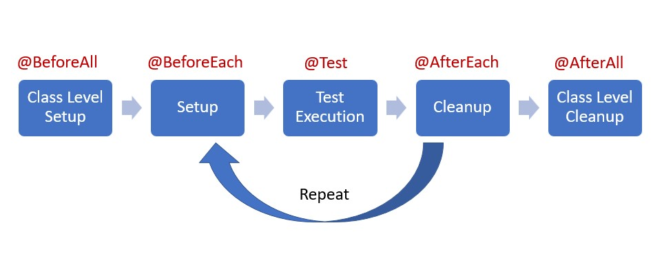

# hw12

## 1. List all the new learned annotations to your annotations.md
## 2. what is selenium(YouTube)?
Selenium is an open-source software framework widely used for automating web browsers. It provides a set of tools and libraries that enable developers and testers to automate web application testing, perform browser interactions, and perform web-scraping tasks. 

Selenium: User-behavior simulation


1. Selenium WebDriver: It is the primary component of Selenium and provides a programming interface to interact with web browsers. WebDriver allows developers to write code in various programming languages (such as Java, Python, C#, etc.) to automate browser actions like clicking links, filling forms, navigating between pages, and validating page content.
2. Selenium Grid: It is a distributed testing solution that allows running tests on multiple machines and browsers simultaneously. Selenium Grid enables parallel testing and provides improved scalability for large-scale test automation.
3. Selenium IDE: It is a browser extension used for creating simple browser automation scripts. Selenium IDE allows recording and playback of interactions with the browser and generates code in the Selenium WebDriver format.
4. Selenium Remote Control (RC): It is the predecessor of WebDriver and provides a client-server architecture for browser automation. However, WebDriver has largely replaced Selenium RC due to its more advanced features and improved performance.

## 3. what is cucumber(YouTube)?
**Cucumber** is a popular open-source testing tool that supports **behavior-driven development** (BDD). It provides a framework for writing and executing automated acceptance tests in a human-readable format. Cucumber allows collaboration between technical and non-technical team members by providing a common language for describing and verifying application behavior.

The main components of Cucumber are:
1. Feature Files: Feature files are written in a plain-text format using the Gherkin language. They describe the behavior and functionality of the application in a structured manner. Each feature file contains one or more scenarios written in a Given-When-Then format.
2. Scenarios: Scenarios are specific test cases described within feature files. They outline a series of steps that describe the interactions and expected outcomes of a particular feature or functionality. Scenarios are written using keywords like Given, When, Then, And, and But.
3. Step Definitions: Step definitions map the steps defined in the feature files to actual code implementations. They contain the automation logic and instructions for executing each step of the scenario. Step definitions are written in programming languages like Java, Ruby, or JavaScript, depending on the chosen implementation.
4. Test Runner: The test runner is responsible for executing the feature files and the associated step definitions. It reads the feature files, matches the steps to the corresponding step definitions, and executes the automation code accordingly. Cucumber provides test runners for different programming languages.

Feature File (sample.feature):
```gherkin
Feature: Login
  As a user
  I want to log in to the application
  So that I can access my account

  Scenario: Successful Login
    Given I am on the login page
    When I enter username "john" and password "pass123"
    And I click the login button
    Then I should be logged in
    And I should see the dashboard page
```

Step Definitions (SampleStepDefinitions.java):
```java
public class SampleStepDefinitions {

    @Given("I am on the login page")
    public void navigateToLoginPage() {
        // Code to navigate to the login page
    }

    @When("I enter username {string} and password {string}")
    public void enterCredentials(String username, String password) {
        // Code to enter the username and password
    }

    @And("I click the login button")
    public void clickLoginButton() {
        // Code to click the login button
    }

    @Then("I should be logged in")
    public void verifyLoggedIn() {
        // Code to verify that the user is logged in
        Assert.assertTrue("User is not logged in", isLoggedIn());
    }

    @And("I should see the dashboard page")
    public void verifyDashboardPage() {
        // Code to verify that the dashboard page is displayed
        Assert.assertTrue("Dashboard page is not displayed", isDashboardPageDisplayed());
    }

    // Helper methods
    private boolean isLoggedIn() {
        // Code to check if the user is logged in
        return true; // Assuming the user is logged in
    }

    private boolean isDashboardPageDisplayed() {
        // Code to check if the dashboard page is displayed
        return true; // Assuming the dashboard page is displayed
    }
}
```

## 4. what is JMeter(YouTube)?
Apache **JMeter** is an open-source **performance testing** tool designed to test the performance and load of web applications, APIs, and other services. It allows you to simulate real-world user behavior and generate load on the target system to measure its performance under various conditions.

Key features of JMeter include:
1. Test Plan: JMeter operates based on a test plan, which defines the structure and configuration of the performance test. The test plan includes elements such as thread groups, samplers, listeners, timers, and assertions.
2. Thread Groups: Thread groups represent a group of virtual users or threads that simulate user actions on the target system. Each thread group can be configured with specific settings like the number of threads, ramp-up time, and loop count.
3. Samplers: Samplers are responsible for generating requests to the target system, such as HTTP requests, FTP requests, JDBC database requests, or SOAP/XML-RPC requests. JMeter supports a wide range of protocols and can simulate various types of interactions.
4. Listeners: Listeners collect and display the test results generated during the execution of the performance test. They provide valuable insights into metrics like response time, throughput, error rate, and other performance-related data.
5. Timers: Timers introduce delays between requests to simulate realistic user behavior and to control the pacing of the load on the target system.
6. Assertions: Assertions allow you to define criteria to validate the response received from the target system. They help verify that the system is functioning as expected and highlight any discrepancies or errors.
7. Reports: JMeter generates comprehensive reports and graphs to analyze the performance test results. The reports provide insights into metrics like response time, latency, throughput, error rate, and other performance indicators.

## 5. what is unit-test?
Unit testing is a software testing technique that focuses on testing individual units, or the smallest testable parts, of a software system in isolation. These units typically refer to **functions, methods, or classes** in object-oriented programming.

The primary goal of unit testing is to verify that each unit of code functions correctly and behaves as expected. By isolating the units and testing them independently, developers can identify and fix defects early in the development process, which leads to more reliable and maintainable software.

Here are some key characteristics and benefits of unit testing:
1. Isolation: Unit tests are designed to run in isolation from the rest of the software system. Dependencies on other units or external systems are usually mocked or stubbed to ensure that failures or issues in other components don't affect the test results.
2. Automation: Unit tests are typically automated, allowing developers to run them repeatedly and conveniently during the development process. Test frameworks and tools, such as JUnit for Java, provide support for organizing and executing unit tests.
3. Fast Execution: Unit tests are small in scope and have minimal dependencies, enabling them to execute quickly. Fast execution is essential to provide rapid feedback to developers and support running tests frequently.
4. Early Bug Detection: Unit tests allow for early detection of bugs and issues at the smallest testable unit level. By catching and fixing defects early, developers can prevent the propagation of problems to other parts of the codebase, reducing the effort required for debugging and maintenance later on.
5. Refactoring Support: Unit tests act as a safety net during code refactoring. When making changes to the codebase, developers can run unit tests to ensure that the desired functionality remains intact. If any tests fail after refactoring, it indicates that the changes have potentially introduced regressions or errors.
6. Documentation and Design Aid: Well-written unit tests serve as documentation for the behavior and expected outcomes of the code units. They provide insights into how the code should be used, the inputs it expects, and the outputs it produces. Additionally, writing unit tests often leads to better design practices, such as writing modular and loosely coupled code.

Unit testing is an integral part of test-driven development (TDD) and agile software development methodologies. It fosters code quality, improves maintainability, and enhances confidence in the software's correctness and stability.

## 6. What is the lifecycle of Junit?

The complete lifecycle of a test case can be seen in three phases with the help of annotations.

1. Setup: This phase puts the test infrastructure in place. JUnit provides class level setup (@BeforeAll) and method level setup (@BeforeEach). Generally, heavy objects like database connections are created in class level setup while lightweight objects like test objects are reset in the method level setup.
2. Test Execution: In this phase, the test execution and assertion happen. The execution result will signify a success or failure.
3. Cleanup: This phase is used to cleanup the test infrastructure setup in the first phase. Just like setup, teardown also happens at class level (@AfterAll) and method level (@AfterEach).

## 7. Is @BeforeAll method should be Class level(static)?
The `@BeforeAll` method in JUnit should be defined at the class level and should be declared as static. The `@BeforeAll` annotation is used in JUnit 5 to mark a method that should be executed once before all the test methods in a test class.

## 8. What is Mockito? And what are its limitations?
Mockito is a popular open-source mocking framework for Java. It allows developers to create mock objects, also known as test doubles, to simulate the behavior of real objects in order to perform unit testing and isolate dependencies.

Here are the key features and benefits of Mockito:
1. Mocking: Mockito provides APIs to create mock objects that mimic the behavior of real objects. These mock objects can be programmed to return specific values, throw exceptions, or simulate certain behaviors when methods are invoked.
2. Simplified Test Setup: Mockito simplifies the setup of unit tests by handling the creation and configuration of mock objects. This allows developers to focus on defining the expected interactions and behaviors of the objects being tested.
3. Verification: Mockito provides methods to verify that specific methods were called on the mock objects and to verify the number of invocations, order of calls, and arguments passed to the methods.
4. Stubbing: Mockito allows developers to stub the behavior of mock objects by specifying the desired return values for method invocations. This helps control the test scenarios and simulate different conditions.
5. Integration with Testing Frameworks: Mockito integrates well with popular testing frameworks such as JUnit and TestNG, making it easy to incorporate mock objects into test cases and assertions.
6. Flexibility: Mockito supports a wide range of mocking scenarios, including mocking interfaces, concrete classes, and abstract classes. It can also mock static methods, final classes, and private methods through specific configurations.

Despite its advantages, Mockito does have some limitations:
1. Limited Support for Final Methods and Classes: Mockito cannot directly mock final methods and final classes. However, there are workarounds available, such as using the PowerMock library in combination with Mockito to overcome this limitation.
2. Limitations with Static Methods: Mockito cannot directly mock static methods. Similar to the limitation with final methods, the PowerMock library can be used to mock static methods in conjunction with Mockito.
3. Excessive Mocking: Mockito should be used judiciously to avoid excessive mocking. Overusing mocks can lead to tests that are tightly coupled to the implementation details and make tests fragile and difficult to maintain.
4. Limited Support for Spying: Mockito provides the ability to spy on real objects and partially mock them. However, there are limitations when it comes to spying on objects with final methods or classes, static methods, or private methods.
5. Complex Object Behavior: Mockito may have limitations when dealing with complex object behavior or internal state manipulation. In such cases, other techniques like dependency injection or real implementations may be more appropriate.

## 9. What is @Mock and what is @InjectMocks?
`@Mock` Annotation:  
The `@Mock` annotation is used to create a mock object of a class or interface. It is typically used to simulate the behavior of dependencies or collaborators of the class being tested.

When a field or parameter is annotated with `@Mock`, Mockito creates a mock object of the specified type. This allows you to define the behavior of the mock object using Mockito's API and use it in your test methods.

Here's an example of using @Mock:
```java
import org.mockito.Mock;
import org.junit.jupiter.api.Test;
import org.junit.jupiter.api.BeforeEach;
import org.mockito.MockitoAnnotations;

public class MyTestClass {

    @Mock
    private SomeDependency someDependency;

    @BeforeEach
    void setup() {
        MockitoAnnotations.initMocks(this);
    }

    @Test
    void testMethod() {
        // Use the mocked dependency in the test
    }
}
```
In the above example, the `@Mock` annotation is used to create a mock object of the `SomeDependency` class. The `MockitoAnnotations.initMocks(this)` method is called in the `@BeforeEach` method to initialize the mock object.

`@InjectMocks` Annotation:  
The `@InjectMocks` annotation is used to automatically inject the mock objects created with `@Mock` into the class being tested.

When a field or parameter is annotated with `@InjectMocks`, Mockito will try to inject the mock objects that are created with `@Mock` into the corresponding fields of the class under test.

Here's an example of using @InjectMocks:
```java
import org.mockito.InjectMocks;
import org.mockito.Mock;
import org.junit.jupiter.api.Test;
import org.junit.jupiter.api.BeforeEach;
import org.mockito.MockitoAnnotations;

public class MyTestClass {

    @Mock
    private SomeDependency someDependency;

    @InjectMocks
    private MyClass myClass; // Class under test

    @BeforeEach
    void setup() {
        MockitoAnnotations.initMocks(this);
    }

    @Test
    void testMethod() {
        // Use the injected mock dependency in the test
    }
}
```
In the above example, the `@InjectMocks` annotation is used to automatically inject the mock object of `SomeDependency` into the `someDependency` field of the `MyClass` instance.

It's important to note that for `@InjectMocks` to work correctly, the class under test should have a default constructor or a constructor with dependencies that can be resolved by Mockito. Mockito will automatically inject the mock dependencies into the appropriate fields or constructor parameters based on the types.

## 10. What is the stubbing?
Stubbing refers to the process of defining the behavior of a mock object or test double in order to simulate a particular scenario during testing. In other words, stubbing allows you to set up predetermined responses for method invocations on a mock object.

When stubbing a mock object, you define the expected return values or behaviors of specific methods to ensure that the test case executes as intended. This allows you to control the behavior of the mock object and simulate different scenarios, even if the real object being mocked may have complex or unpredictable behavior.

```java
import static org.mockito.Mockito.*;

public class MyTestClass {

    @Test
    void testMethod() {
        // Create a mock object
        SomeClass mockObject = mock(SomeClass.class);

        // Stubbing: Define the behavior of a method
        when(mockObject.someMethod()).thenReturn("Mocked value");

        // Perform the test
        String result = mockObject.someMethod();

        // Verify the expected behavior
        assertEquals("Mocked value", result);
        verify(mockObject, times(1)).someMethod();
    }
}
```
In the above example, the `someMethod()` of the `SomeClass` mock object is stubbed using the `thenReturn()` method. This stubbing sets up the behavior such that when `someMethod()` is called on the mock object, it will return the string value "Mocked value".

During the test execution, when `mockObject.someMethod()` is invoked, it will return the stubbed value "Mocked value" instead of executing the real implementation. The stubbed behavior allows you to control the output and ensure consistent test results.

Stubbing is useful when you want to isolate specific parts of your code and focus on testing a particular scenario without relying on the actual behavior of the dependencies. By stubbing the dependencies, you can ensure that your test cases execute consistently and predictably, even if the real objects may have varying or non-deterministic behavior.

## 11. what is Mockito ArgumentMatchers
Mockito ArgumentMatchers are utility methods provided by Mockito to match and verify method arguments during test execution. These argument matchers allow you to define flexible and dynamic matching conditions for method invocations on mock objects.

ArgumentMatchers are commonly used in conjunction with stubbing and verification methods in Mockito to specify the expected arguments for method calls. They provide a range of matching options to handle different scenarios, including exact value matching, partial matching, and more.
Here are some commonly used ArgumentMatchers in Mockito:
1. `any()`, `any(Class<T> clazz)`: Matches any argument of the specified type, ignoring its actual value. For example, `any(String.class)` matches any string argument.
2. `eq(T value)`: Matches the argument that is equal to the specified value. For example, eq(42) matches the argument that is equal to 42.
3. `isNull()`, `isNotNull()`: Matches null or non-null arguments, respectively.
4. `startsWith(String prefix)`, `endsWith(String suffix)`, `contains(String substring)`: Matches arguments that start with, end with, or contain the specified substring.
5. `argThat(ArgumentMatcher<T> matcher)`: Matches arguments based on a custom argument matcher implementation. You can create your own matcher by implementing the `ArgumentMatcher` interface.

## 12. what is Hamcrest Matchers?

Hamcrest Matchers is a library that provides a collection of matchers for performing more expressive and readable assertions in unit tests. It is commonly used in conjunction with testing frameworks like JUnit or TestNG.

Hamcrest matchers allow you to write assertions in a more fluent and declarative manner, making the test code more readable and easier to understand. These matchers provide a wide range of assertion options to match different types of values and perform complex assertions.

Some key features and benefits of Hamcrest matchers include:
1. Readability: Hamcrest matchers use a fluent API and natural language syntax that closely resembles plain English, making the assertions more readable and expressive.
2. Flexibility: Hamcrest provides a rich set of matchers to handle various types of assertions, including comparing values, checking collection contents, validating string patterns, and more.
3. Extensibility: Hamcrest allows you to create your own custom matchers by implementing the Matcher interface, enabling you to define specific assertion rules for your domain-specific objects.
4. Integration: Hamcrest integrates well with popular testing frameworks and assertion libraries, such as JUnit, TestNG, and Mockito. It can be seamlessly used alongside these frameworks to enhance the readability and clarity of your test code.
```java
import static org.hamcrest.MatcherAssert.assertThat;
import static org.hamcrest.Matchers.*;

public class MyTestClass {

    @Test
    void testMethod() {
        // Perform some operations
        int actualValue = performSomeOperation();

        // Use Hamcrest matchers for assertions
        assertThat(actualValue, is(equalTo(42)));
        assertThat(actualValue, greaterThan(0));
        assertThat(actualValue, anyOf(equalTo(42), equalTo(99)));
        assertThat(actualValue, not(lessThan(0)));
    }
}
```

## 13. do you know @spy? what is the difference between @spy and @Mock?
`@Spy` is an annotation used to create a partial mock object that wraps a real object. It allows you to retain the original behavior of the real object while still being able to stub or verify specific methods.

The main difference between `@Spy` and `@Mock` is how the objects are created and their behavior during test execution:

`@Mock`: When using `@Mock`, Mockito creates a completely new mock object of the specified class or interface. The mock object has no knowledge of the real implementation and does not retain any of its behavior unless explicitly specified.

Example:
```java
@Mock
private SomeClass mockObject;
```

`@Spy`: With `@Spy`, Mockito creates a partial mock object by wrapping an existing instance of the specified class. The spy object retains the real implementation of the methods, and you can stub or verify specific methods while keeping the original behavior for unstubbed methods.
```java
@Spy
private SomeClass spyObject = new SomeClass();
```

When using `@Mock`, you typically start with a clean slate and define the desired behavior for each method you want to stub or verify. On the other hand, `@Spy` allows you to retain the original behavior of the real object by default, and you can choose which specific methods to override or stub.

```java
public class SomeClass {
    public int add(int a, int b) {
        return a + b;
    }
}

public class MyTestClass {

    @Mock
    private SomeClass mockObject;

    @Spy
    private SomeClass spyObject = new SomeClass();

    @BeforeEach
    void setup() {
        MockitoAnnotations.initMocks(this);
    }

    @Test
    void testMethodWithMock() {
        when(mockObject.add(2, 3)).thenReturn(10);

        int result = mockObject.add(2, 3);

        assertEquals(10, result);
        verify(mockObject).add(2, 3);
    }

    @Test
    void testMethodWithSpy() {
        int result = spyObject.add(2, 3);

        assertEquals(5, result);
        verify(spyObject).add(2, 3);
    }
}
```
In the above example, the `testMethodWithMock()` test uses `@Mock` to create a mock object. The behavior of the `add()` method is stubbed to return 10 when called with arguments 2 and 3. The test verifies that the stubbed behavior is executed.

On the other hand, the `testMethodWithSpy()` test uses `@Spy` to create a spy object. The real implementation of the `add()` method is retained, so when called with arguments 2 and 3, the actual addition is performed, resulting in a value of 5. The test verifies that the original behavior is executed.

In summary, `@Mock` creates a fully mock object with no real behavior, while `@Spy` creates a partial mock object that retains the real behavior by default. The choice between @Mock and `@Spy` depends on whether you want to start with a clean mock or retain the real behavior for certain methods.
## 14. briefly reading this articles
a. https://www.javatpoint.com/examples-of-mockito-and-junit-in-eclipse-ide  
b. https://www.javatpoint.com/junit-tutorial  
c. https://www.javatpoint.com/testng-tutorial  
d. https://www.javatpoint.com/jmeter-tutorial  

## 15. Add unit test for CommentServiceImpl, the coverage should be 100%.
Please check `CommentServiceImplTest.java`