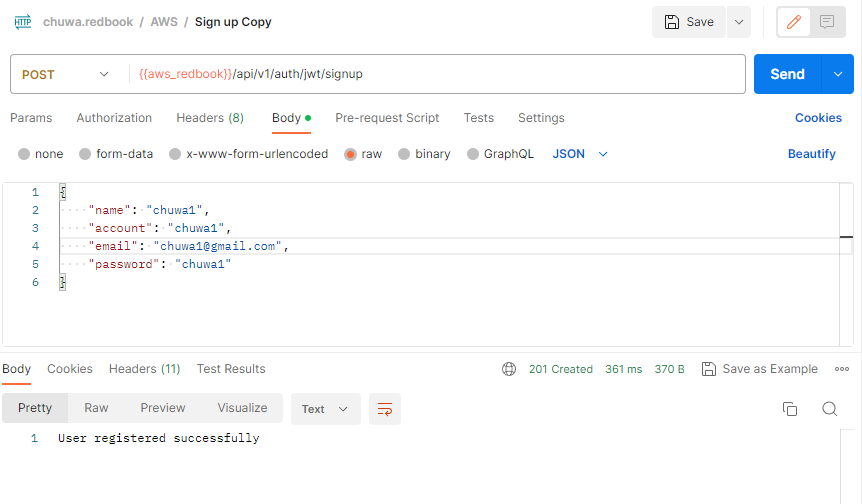
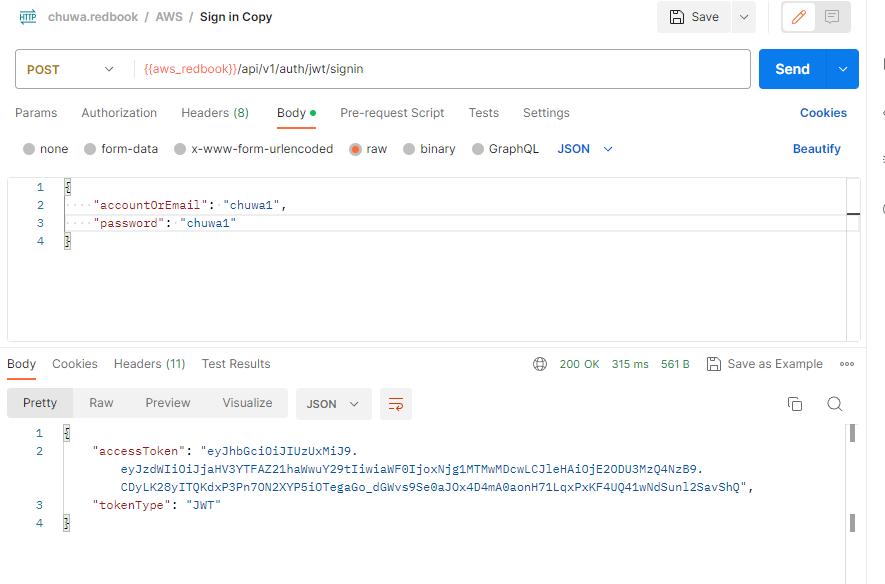
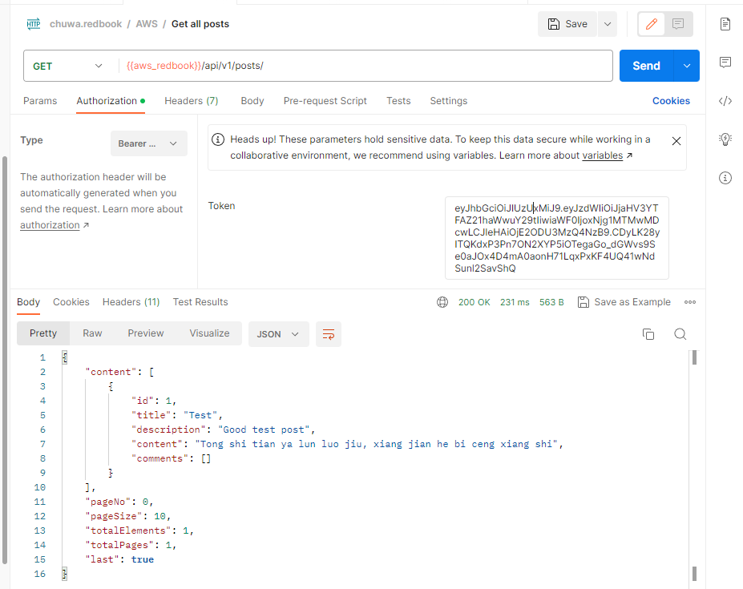

# hw13
## Deploy redbook to AWS
1. Sign up an account through link: http://redbook.us-west-2.elasticbeanstalk.com/api/v1/auth/jwt/signup
  

2. Sign in with the account information through the link (http://redbook.us-west-2.elasticbeanstalk.com/api/v1/auth/jwt/signin) and get a token: 

3. Get all post through the link (http://redbook.us-west-2.elasticbeanstalk.com/api/v1/posts/) with token and get all 
   posts.

