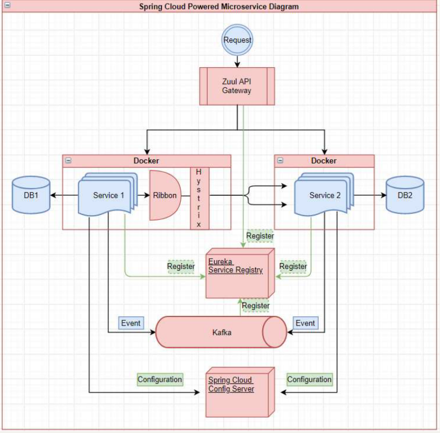
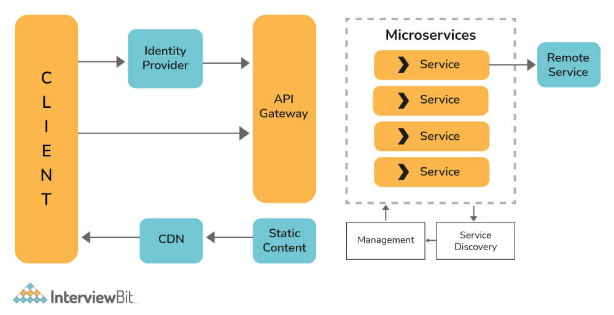
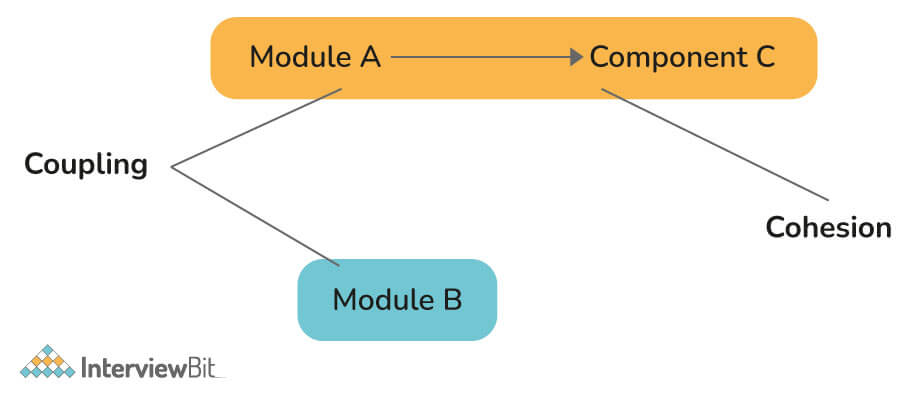
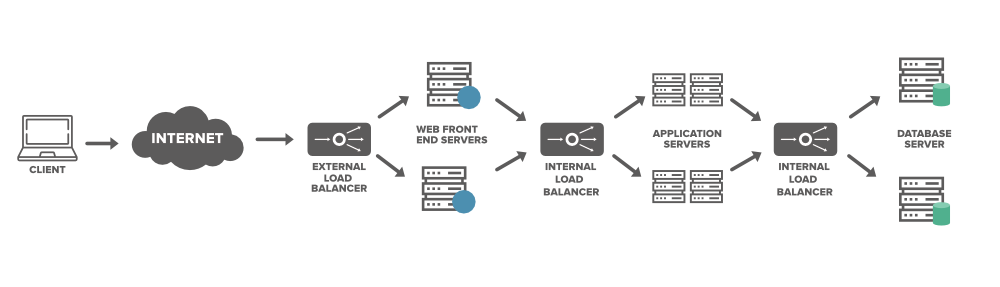
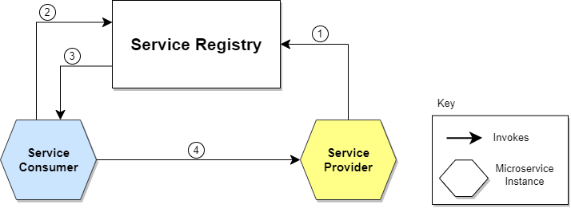

# hw14
## 1. list all the new annotations you learned to your annotations.md
## 2. Document the microservice architecture and components/tools/dependencies

**API Gateway:** The request is received by the API Gateway, which acts as a single entry point for all client requests. It may perform authentication, rate limiting, and request validation before forwarding the request. **Zuul, Spring Cloud Gateway**.

**Service Registry:** The API Gateway consults the service registry to determine the location and availability of the requested microservice. It allows services to **locate and communicate** with each other dynamically. Tools like Netflix **Eureka**, Consul, or Kubernetes' built-in service discovery mechanism can be used for service discovery.

**Load Balancing:** If multiple instances of the requested microservice are available, a load balancer selects an appropriate instance based on various factors like server health, response time, or round-robin.  Load balancing ensures even distribution of incoming requests across multiple instances of a service. It improves scalability, performance, and high availability.  **Nginx, Ribbon.**

**Circuit Breaker**: Circuit breakers help in fault tolerance and resilience by preventing cascading failures. They monitor the availability of services and can temporarily halt requests to a failing service to avoid overloading it. **Hystrix**, **Resilience4j**, and Istio's circuit breaker features are popular choices for implementing circuit breakers.

**Message Brokers/Event Streaming**: Message brokers facilitate asynchronous communication and **event-driven** architectures in microservices. They enable loose coupling between services by decoupling producers and consumers of messages. Apache **Kafka** (Event Driven, RabbitMQ, and Apache Pulsar are widely used message brokers in microservice architectures.

**Spring Cloud Config Server** is a component of the Spring Cloud framework that provides centralized configuration management for distributed systems. It allows you to externalize and manage the configuration of your microservices in a centralized location, making it easier to manage and update configurations across different environments.

**Containerization**: Containers, such as **Docker**, provide lightweight, isolated environments for running microservices. They encapsulate the application and its dependencies, making it easier to package, deploy, and scale microservices consistently across different environments.

**Service Monitoring and Logging**: Monitoring and logging tools help track the health, performance, and behavior of microservices. They provide insights into service metrics, logs, and distributed tracing for troubleshooting and performance optimization.

1. Client makes a request: The client application initiates a request to the system by sending a request message or API call.
2. API Gateway: The request is received by the API Gateway, which acts as a single entry point for all client requests. It may perform authentication, rate limiting, and request validation before forwarding the request.
3. Service Registry: The API Gateway consults the service registry to determine the location and availability of the requested microservice.
4. Load Balancing: If multiple instances of the requested microservice are available, a load balancer selects an appropriate instance based on various factors like server health, response time, or round-robin.
5. Microservice Handler: The load balancer forwards the request to the selected microservice instance.
6. Microservice Logic: The microservice receives the request and performs the necessary business logic or data processing. This may involve accessing databases, external APIs, or other microservices.
7. Response Generation: After processing the request, the microservice generates a response message or payload.
8. Reverse Proxy: The response is sent back to the API Gateway through a reverse proxy.
9. Response Aggregation: The API Gateway may aggregate responses from multiple microservices if needed.
10. Response to the Client: Finally, the API Gateway sends the response back to the client application that initiated the request.

## 3. What are Resilience patterns? What is a circuit breaker?
Resilience patterns are design patterns and techniques used in software development to improve the fault tolerance and reliability of distributed systems. They help systems to gracefully handle failures and provide **fallback** mechanisms when things go wrong. Resilience patterns aim to enhance system stability, prevent cascading failures, and improve overall system performance.

One commonly used resilience pattern is the **Circuit Breaker** pattern. A circuit breaker is a mechanism that allows a service or application to **handle failures** and **prevent further requests** to a failing component, thereby protecting the system from prolonged downtime or performance degradation. It acts as a safety valve in the system by monitoring the state of the component it is protecting.

## 4. Read this article, then list the important questions, then write your answers
   a. https://www.interviewbit.com/microservices-interview-questions/#main-features-of-microservices

### 1) What is microservice?
A microservice is a software architectural style that structures an application as a collection of small, loosely coupled, and independently deployable services. Each service in a microservice architecture represents a specific business capability and is responsible for performing a specific task or function.

### 2) Write main features of Microservices.
* Decoupling: Within a system, services are largely decoupled. The application as a whole can therefore be easily constructed, altered, and scalable
* Componentization: Microservices are viewed as independent components that can easily be exchanged or upgraded
* Business Capabilities: Microservices are relatively simple and only focus on one service
* Team autonomy: Each developer works independently of each other, allowing for a faster project timeline
* Continuous Delivery: Enables frequent software releases through systematic automation of software development, testing, and approval
* Responsibility: Microservices are not focused on applications as projects. Rather, they see applications as products they are responsible for
* Decentralized Governance: Choosing the right tool according to the job is the goal. Developers can choose the best tools to solve their problems
* Agility: Microservices facilitate agile development. It is possible to create new features quickly and discard them again at any time.

### 3) Write main components of Microservices.
* Containers, Clustering, and Orchestration
* IaC [Infrastructure as Code Conception]
* Cloud Infrastructure
* API Gateway
* Enterprise Service Bus
* Service Delivery

### 4) What are the benefits and drawbacks of Microservices?
   Benefits:  
* Self-contained, and independent deployment module.
* Independently managed services.   
* In order to improve performance, the demand service can be deployed on multiple servers.   
* It is easier to test and has fewer dependencies.  
* A greater degree of scalability and agility.   
* Simplicity in debugging & maintenance.  
* Better communication between developers and business users.   
* Development teams of a smaller size.  

Drawbacks:
* Due to the complexity of the architecture, testing and monitoring are more difficult.  
* Lacks the proper corporate culture for it to work.   
* Pre-planning is essential.  
* Complex development.  
* Requires a cultural shift.  
* Expensive compared to monoliths.   
* Security implications.
* Maintaining the network is more difficult.
### 5) Explain the working of Microservice Architecture.

* Clients: Different users send requests from various devices.
* Identity Provider: Validate a user's or client's identity and issue security tokens.
* API Gateway: Handles the requests from clients.
* Static Content: Contains all the system's content.
* Management: Services are balanced on nodes and failures are identified.
* Service Discovery: A guide to discovering the routes of communication between microservices.
* Content Delivery Network: Includes distributed network of proxy servers and their data centers.
* Remote Service: Provides remote access to data or information that resides on networked computers and devices.

### 6) Explain spring cloud and spring boot.
**Spring Cloud:** In Microservices, the Spring cloud is a system that integrates with external systems. This is a short-lived framework designed to build applications quickly. It contributes significantly to microservice architecture due to its association with finite amounts of data processing. Some of the features of spring cloud are shown below:

**Spring Boot:** Spring Boot is an open-sourced, Java-based framework that provides its developers with a platform on which they can create stand-alone, production-grade Spring applications. In addition to reducing development time and increasing productivity, it is easily understood.

### 7) What issues are generally solved by spring clouds?
The following problems can be solved with spring cloud:

* **Complicated issues caused by distributed systems:** This includes network issues, latency problems, bandwidth problems, and security issues.
* **Service Discovery issues:** Service discovery allows processes and services to communicate and locate each other within a cluster.
* **Redundancy issues:** Distributed systems can often have redundancy issues.
* **Load balancing issues:** Optimize the distribution of workloads among multiple computing resources, including computer clusters, central processing units, and network links.
* **Reduces performance issues:** Reduces performance issues caused by various operational overheads.

### 8) What do you mean by Cohesion and Coupling?

* **Coupling:** It is defined as a relationship between software modules A and B, and how much one module depends or 
interacts with another one. Couplings fall into three major categories. Modules can be highly coupled (highly dependent), loosely coupled, and uncoupled from each other. The best kind of coupling is loose coupling, which is achieved through interfaces.

* **Cohesion:** It is defined as a relationship between two or more parts/elements of a module that serves the same 
purpose. Generally, a module with high cohesion can perform a specific function efficiently without needing communication with any other modules. High cohesion enhances the functionality of the module.

### 9) Explain the term Eureka in Microservices.
Eureka Server, also referred to as Netflix Service Discovery Server, is an application that keeps track of all client-service applications. As every Microservice registers to Eureka Server, Eureka Server knows all the client applications running on the different ports and IP addresses. It generally uses Spring Cloud and is not heavy on the application development process.

## 5. how to do load balance in microservice? Write a long Summary by yourself.
   a. https://www.geeksforgeeks.org/load-balancer-system-design-interview-question/  
   b. https://www.fullstack.cafe/blog/load-balancing-interview-questions

### What is a Load Balancer?
A load balancer works as a “traffic cop” sitting in front of your server and routing client requests across all servers. It simply **distributes the set of requested operations (database write requests, cache queries) effectively across multiple servers and ensures that no single server bears too many requests that lead to degrading the overall performance of the application.** A load balancer can be a physical device or a virtualized instance running on specialized hardware or a software process.

**The Purpose of load balancing is to**
* Optimize resource usage (avoid overload and under-load of any machines)
* Achieve Maximum Throughput
* Minimize response time

**Most common load balancing techniques in web based applications are**
* Round robin
* Session affinity or sticky session
* IP Address affinity

### Where Are Load Balancers Typically Placed?

* In between the client application/user and the server
* In between the server and the application/job servers
* In between the application servers and the cache servers
* In between the cache servers the database servers

1. **Client-side Load Balancing:** In this approach, the client (service consumer) is responsible for distributing the load among multiple instances of a service. The client uses a load balancing algorithm to determine which service instance to send each request to. The popular load balancing algorithms include round-robin, random, and weighted distribution. The client can periodically refresh the list of available service instances to handle changes in the service topology.
2. **Server-side Load Balancing:** In this approach, a load balancer component is placed in front of the microservices. The load balancer receives incoming requests and distributes them across multiple service instances based on predefined rules. The load balancer can perform health checks on service instances and remove any unhealthy instances from the rotation. Examples of server-side load balancers include Nginx, HAProxy, and cloud provider load balancing services.
3. **Service Registry and Discovery:** In this approach, a centralized service registry is used to keep track of all available service instances and their network locations. Service instances register themselves with the registry upon startup, and clients can query the registry to discover available service instances. The client then uses client-side load balancing to distribute the load across the discovered instances. Popular service registry and discovery tools include Netflix Eureka, Consul, and etcd.
4. **Container Orchestration Platforms:** Container orchestration platforms like Kubernetes provide built-in load balancing capabilities. They automatically distribute incoming requests across multiple replicas of a microservice deployed as containers. The platform monitors the health of the service instances and automatically scales the number of replicas based on demand.

## 6. How to do service discovery?
Service Registration: Each microservice instance registers itself with a service registry upon startup. The service registry acts as a centralized database or directory that keeps track of available service instances. During registration, a microservice provides information such as its network location (IP address and port), service ID, and any metadata associated with it.

1. The location of the Service Provider is sent to the Service Registry (a database containing the locations of all available service instances).
2. The Service Consumer asks the Service Discovery Server for the location of the Service Provider.
3. The location of the Service Provider is searched by the Service Registry in its internal database and returned to the Service Consumer.
4. The Service Consumer can now make direct requests to the Service Provider.

## 7. What are the major components of Kafka?
Kafka is a distributed streaming platform that is designed to handle high-throughput, fault-tolerant, and real-time data streams. The major components of Kafka are as follows:

1. Topics: Topics are the core abstraction in Kafka. They represent a specific stream of records, which can be categorized and partitioned. Topics are typically divided into multiple partitions for scalability and parallel processing.
2. Producers: Producers are the entities that publish data to Kafka topics. They write records to one or more topics by specifying the target topic and optionally the partition to which the record should be written. Producers can be designed to be highly available and fault-tolerant.
3. Consumers: Consumers are the entities that read and process the data from Kafka topics. They subscribe to one or more topics and consume records in the order they were written. Consumers can be part of a consumer group to scale the processing and achieve load balancing.
4. Brokers: Brokers are the servers that form the Kafka cluster. They handle the storage, replication, and distribution of data across topics and partitions. Brokers are responsible for maintaining the durability and fault-tolerance of data by persisting it to disk.
5. Partitions: Topics are divided into multiple partitions, and each partition is ordered and immutable. Partitions allow for horizontal scalability by distributing the data across multiple brokers. Each partition is replicated to ensure fault-tolerance and high availability.
6. Offsets: Offsets represent the position of a consumer within a partition. Each message within a partition is assigned a unique offset, which can be used by consumers to track their progress and resume reading from a specific position.
7. Consumer Groups: Consumer groups are a way to scale the processing of messages in Kafka. Consumers within a group work together to consume and process the records from one or more topics. Each record is processed by only one consumer within the group, allowing for parallel processing and load balancing.

## 8. What do you mean by a Partition in Kafka?
Partitions: Topics are divided into multiple partitions, and each partition is ordered and immutable. Partitions allow for horizontal scalability by distributing the data across multiple brokers. Each partition is replicated to ensure fault-tolerance and high availability.

* Data is assigned randomly to a partition unless a key is provided
* Data is kept only for a limited time(default it one week)
* Each partition is ordered and Order is guaranteed only within a partition(not across partitions)
* Once the data is written to a partition, it can't be changed(immutability)
* Each message within a partition gets an incremental id, called offset

## 9. What do you mean by zookeeper in Kafka and what are its uses?
In Kafka, Apache ZooKeeper is a centralized service used for maintaining and managing the metadata of the Kafka cluster. It plays a critical role in the coordination and synchronization of distributed systems, including Kafka.

Zookeeper is used to track cluster state, membership, and leadership

Zookeeper is used for metadata management in the Kafka world. For example:
* Zookeeper keeps track of which brokers are part of the Kafka cluster
* Zookeeper is used by Kafka brokers to determine which broker is the leader of a given partition and topic and perform leader elections
* Zookeeper stores configurations for topics and permissions
* Zookeeper sends notifications to Kafka in case of changes (e.g. new topic, broker dies, broker comes up, delete topics, etc.…)

## 10. Can we use Kafka without Zookeeper?
Zookeeper Being Eliminated from Kafka v4.x

* Kafka 0.x, 1.x & 2.x must use Zookeeper
* Kafka 3.x can work without Zookeeper (KIP-500) but is not production ready yet
* Kafka 4.x will not have Zookeeper

## 11. Explain the concept of Leader and Follower in Kafka.
1. Leader:
   * Each partition in a Kafka topic is assigned a leader.
   * The leader is responsible for handling all read and write requests for that partition.
   * Producers send messages to the leader of the partition.
   * Consumers fetch messages from the leader of the partition.

2. Follower:
   * Each partition can have one or more followers.
   * Followers replicate the leader's data by continuously synchronizing with the leader.
   * The followers are in sync with the leader, maintaining an identical copy of the data.
   * If the leader fails, one of the followers is elected as the new leader to ensure continuous operation.
   * Followers can handle read requests if the leader is busy serving write requests, providing increased read scalability.

## 12. Why is Topic Replication important in Kafka? What do you mean by ISR in Kafka?
Topic replication is an essential feature in Kafka that provides high availability, fault tolerance, and data durability. Here's why topic replication is important:

1. Fault Tolerance: By replicating topic partitions across multiple brokers, Kafka ensures that data remains available even if a broker or a few brokers fail. Replicas serve as backups, allowing for seamless failover in case of failures.
2. High Availability: With replicated partitions, Kafka can distribute the load among multiple brokers, enabling parallel processing and reducing the risk of overload. If a broker becomes unavailable, the replicated partition can still be served by other brokers, ensuring continuous availability.
3. Data Durability: Replication ensures that data is not lost even if individual brokers or disks fail. Kafka guarantees durability by committing messages to multiple replicas before considering them as successfully written. This protects against data loss and ensures reliable data storage.

ISR (In-Sync Replica) is a concept related to topic replication in Kafka. In a Kafka cluster, not all replicas for a partition are always in sync with the leader. ISR represents the set of replicas that are currently caught up with the leader's data. ISR plays a crucial role in ensuring data consistency and reliability:

1. Leader and ISR: The leader is responsible for handling read and write requests, and it must ensure that all replicas in the ISR are synchronized with its data. This ensures that only replicas with up-to-date data can be elected as leaders during failover.
2. Replication Lag: Replicas that fall behind the leader's data are temporarily removed from the ISR until they catch up. This helps maintain data consistency and avoids the possibility of stale data being read by consumers.
3. Preferred Leader Election: When a leader fails, Kafka uses ISR information to elect a new leader from the replicas in the ISR. This ensures that the new leader is the replica with the most up-to-date data, minimizing data loss and ensuring consistency.

## 13. What do you understand about a consumer group in Kafka?
A consumer group in Kafka is a logical grouping of consumers that work together to consume and process messages from one or more topics. When a topic is consumed by a consumer group, Kafka ensures that each message in the topic is delivered to only one consumer within the group. The messages within a topic are partitioned, and each partition is consumed by only one consumer within a consumer group. The consumer group coordinates the distribution of partitions among its members and manages the offset tracking for each partition.

## 14. How do you start a Kafka server?
1. [ ] Install Kafka
2. [ ] Configure ZooKeeper
3. [ ] Configure Kafka
4. [ ] Start ZooKeeper
5. [ ] Start Kafka
6. [ ] Verify the Kafka server
## 15. Tell me about some of the real-world usages of Apache Kafka.
1. Event Streaming and Messaging: Kafka is commonly used as a messaging system for real-time data streaming and event-driven architectures. It allows different components or microservices within a system to communicate by publishing and consuming events. Kafka's durability, fault tolerance, and ability to handle high volumes of data make it suitable for building scalable and resilient event-driven systems.
2. Log Aggregation: Kafka's log-based architecture makes it an excellent choice for log aggregation and analytics. Applications and services can publish log messages to Kafka topics, and consumers can subscribe to these topics to process and analyze the logs in real-time. Kafka's fault tolerance ensures that logs are not lost even if the consumer systems are temporarily unavailable.
3. Data Pipelines and ETL: Kafka is often used as a backbone for building data pipelines and performing extract, transform, load (ETL) operations. Data can be ingested from various sources into Kafka topics, and then processed and transformed by streaming applications before being loaded into data lakes, data warehouses, or other storage systems. Kafka's ability to handle large data volumes and provide fault tolerance ensures reliable data movement across the pipeline.
4. Real-time Analytics: Kafka facilitates real-time analytics by enabling the ingestion of large volumes of data from multiple sources and making it available for processing in real-time. Streaming applications can consume data from Kafka topics, perform real-time computations, and generate insights or trigger actions based on the analyzed data. This is particularly useful in scenarios such as fraud detection, monitoring systems, and personalized recommendations.
5. Commit Logs and Event Sourcing: Kafka's commit log architecture makes it suitable for applications that require durable storage of events or changes. Event sourcing is a pattern where all changes to an application's state are captured as a sequence of events. Kafka can serve as the storage for these events, allowing applications to process them in the same order they were produced, ensuring data consistency and enabling easy system state recovery.
6. Internet of Things (IoT): Kafka is increasingly used in IoT applications for handling high-volume data streams generated by connected devices. It enables real-time processing and analysis of IoT data, allowing organizations to make timely decisions and respond to events in real-time. Kafka's scalability, fault tolerance, and ability to integrate with various IoT platforms make it a popular choice for building IoT data pipelines.

## 16. Describe partitioning key in Kafka.
In Apache Kafka, a partitioning key is a field or attribute present in the messages being published to a Kafka topic. The partitioning key determines how messages are distributed across the partitions within a topic. Each message is assigned to a specific partition based on its partitioning key, and all messages with the same partitioning key are guaranteed to go to the same partition.

1. Partition Assignment: When a message is produced to a Kafka topic, the partitioning algorithm is applied to the partitioning key to determine the target partition for that message. The algorithm typically involves hashing the partitioning key to ensure a random and even distribution of messages across partitions.
2. Ordering Guarantee: Kafka guarantees the order of messages within a partition. Messages with the same partitioning key will be written to the same partition in the order they are produced. This allows consumers to process related messages in the order of their partitioning key, ensuring message ordering within a logical group.
3. Parallelism and Scalability: Partitioning enables parallelism and scalability in Kafka. By distributing messages across multiple partitions, Kafka can handle high message throughput and allow multiple consumers to process messages in parallel. Each partition can be consumed by a separate consumer, enabling horizontal scaling and higher overall processing capacity.
4. Consumer Assignment: Consumers in a Kafka consumer group can be assigned to consume specific partitions of a topic. This ensures that each partition is consumed by only one consumer in the group, allowing parallel processing. By carefully selecting the partitioning key, you can control which consumer processes specific sets of messages based on the key's value.
5. Partition Count: The number of partitions in a Kafka topic is determined at topic creation and is typically configured based on factors such as expected message throughput, parallelism requirements, and scalability needs. The number of partitions directly affects the maximum parallelism and throughput that can be achieved for that topic.
6. Choosing a Partitioning Key: When selecting a partitioning key, it's essential to consider the desired message ordering, the distribution of messages across partitions, and the load balancing among consumers. Ideally, the partitioning key should have a good spread of values to ensure an even distribution of messages across partitions.

## 17. What is the purpose of partitions in Kafka?
The purpose of partitions in Apache Kafka is to provide scalability, parallelism, and fault tolerance in data processing and message storage. Partitions allow you to break down a Kafka topic into multiple smaller, ordered, and immutable segments, each of which can be independently replicated and processed by consumers. Here are the key purposes and benefits of partitions in Kafka:

1. Scalability: Partitions enable horizontal scalability in Kafka. By dividing a topic into multiple partitions, Kafka can distribute the message load across multiple brokers and effectively handle high message throughput. Each partition can be stored and processed on separate machines, allowing for increased processing capacity as the number of partitions and brokers scale.
2. Parallelism: Partitions facilitate parallel processing of messages. Each partition can be consumed by a separate consumer or consumer group, enabling multiple consumers to work in parallel and process messages concurrently. This parallelism enhances throughput and allows for efficient scaling of consumer applications.
3. Ordering Guarantee: Kafka guarantees the order of messages within a partition. Messages with the same partitioning key or related logical group are written to the same partition in the order they are produced. This ensures that message ordering is maintained within a partition, allowing consumers to process related messages in the desired order.
4. Fault Tolerance: Partitions provide fault tolerance in Kafka. Each partition is replicated across multiple brokers to ensure data redundancy and resilience. If a broker fails, the replicas of the partitions hosted on other brokers can take over, ensuring continuous availability and data durability. Replication also allows for load balancing and enables high availability and failover mechanisms in Kafka.
5. Retention and Data Segmentation: Partitions allow for retention policies and data segmentation. Each partition retains messages for a specified period or based on a certain storage size. This allows for efficient handling of large volumes of data over time. By segmenting data into partitions, you can manage different data streams or categories separately and apply different retention policies based on their requirements.
6. Consumer Group Assignment: Partitions facilitate consumer group assignment. Kafka consumers in a consumer group can be assigned specific partitions to consume from. This ensures that each partition is consumed by only one consumer in the group, enabling parallel processing and load balancing among consumers. Each consumer is responsible for processing the messages in their assigned partitions.
## 18. Differentiate between Rabbitmq and Kafka.

RabbitMQ and Kafka are both popular messaging systems used for handling and processing data and messages in distributed systems, but they have different design philosophies and use cases. Here are some key differences between RabbitMQ and Kafka:

1. Messaging Model:
   * RabbitMQ: RabbitMQ is based on the Advanced Message Queuing Protocol (AMQP) and follows a traditional queuing model. It focuses on reliable message delivery and supports features like message acknowledgment, transactions, and point-to-point messaging. It is well-suited for scenarios where strict message ordering and guaranteed delivery are critical, such as task queues and work distribution.
   * Kafka: Kafka is built as a distributed streaming platform and follows a publish-subscribe model. It provides a high-throughput, fault-tolerant, and scalable system for processing streams of records in real-time. Kafka is designed for handling large volumes of data and is commonly used for event streaming, log aggregation, real-time analytics, and building data pipelines.

2. Data Persistence:
   * RabbitMQ: RabbitMQ persists messages on disk until they are consumed or expired. It provides a durable message storage mechanism with support for message acknowledgment and transactional delivery.
   * Kafka: Kafka is designed as a distributed commit log and persists messages for a configurable retention period on disk. It offers high durability and fault tolerance by replicating data across multiple brokers. Kafka's log-based architecture makes it suitable for scenarios that require fault-tolerant storage and large-scale data processing.
3. Message Semantics:
   * RabbitMQ: RabbitMQ supports messaging patterns such as request-reply, direct exchange, topic-based publish-subscribe, and message routing based on headers. It provides more fine-grained control over message routing and delivery semantics.
   * Kafka: Kafka offers a simplified publish-subscribe model with partitioned topics. It guarantees the order of messages within a partition, allowing for event sourcing, stream processing, and high-throughput data consumption.

4. Performance and Scalability:
   * RabbitMQ: RabbitMQ is known for low-latency message delivery and high throughput. It is well-suited for scenarios with moderate message rates and low latency requirements.
   * Kafka: Kafka is built to handle high-volume, high-throughput workloads. It can handle millions of messages per second and scales horizontally by adding more brokers to the cluster. Kafka's partitioning and replication mechanisms provide parallelism and fault tolerance, making it ideal for data streaming and processing at scale.

5. Ecosystem and Tooling:
   * RabbitMQ: RabbitMQ has a rich ecosystem and supports various client libraries for different programming languages. It offers a web-based management console for monitoring and managing queues and exchanges.
   * Kafka: Kafka has a vibrant ecosystem with support for various client libraries, connectors, and stream processing frameworks like Apache Flink and Apache Spark. It provides a REST API for interacting with the cluster, along with command-line tools for managing topics and partitions.

In summary, RabbitMQ is focused on traditional queuing and reliable message delivery, while Kafka is designed for high-throughput event streaming and processing of large-scale data. The choice between RabbitMQ and Kafka depends on the specific requirements of your use case, such as message ordering, durability, scalability, and the need for real-time stream processing.

## 19. What are the guarantees that Kafka provides?
* Messages are appended to a topic-partition in the order they are sent
* Consumers read messages in the order stored in a topic-partition
* With a replication factor of N, producers and consumers can tolerate up to N-1 brokers being down
* This is why a replication factor of 3 is a good idea:
  * Allows for one broker to be taken down for maintenance
  * Allows for another broker to be taken down unexpectedly
* As long as the number of partitions remains constant for a topic (no new partitions), the same key will always go to the same partition

## 20. What do you mean by an unbalanced cluster in Kafka? How can you balance it?
An unbalanced cluster in Kafka refers to a situation where the partitions of a topic are not evenly distributed across the available brokers or where the workload among the brokers is not evenly distributed. This imbalance can occur due to various reasons such as the addition or removal of brokers, uneven partition assignment, or differences in broker capacities.

To balance an unbalanced cluster in Kafka, you can take the following steps:

1. Monitor Cluster and Partition Distribution: Use Kafka monitoring tools or built-in metrics to monitor the cluster's health and the distribution of partitions among brokers. This will help identify any imbalances and understand the current state of the cluster.
2. Add or Remove Brokers: If the cluster is unbalanced due to differences in broker capacities or uneven workload distribution, you may consider adding or removing brokers. Adding more brokers can distribute the partitions and workload evenly across the cluster, while removing brokers can consolidate partitions and reduce imbalance.
3. Reassign Partitions: Kafka provides a built-in tool called kafka-reassign-partitions.sh that allows you to manually reassign partitions across brokers. This tool enables you to specify the desired partition-to-broker mapping and trigger the reassignment process. By redistributing partitions, you can achieve a more balanced cluster.
4. Use Dynamic Partition Reassignment: Apache Kafka also has a feature called partition reassignment, which allows for automatic and dynamic partition rebalancing. By configuring the auto.leader.rebalance.enable and auto.rebalance.enable parameters in the Kafka broker properties, you can enable automatic partition rebalancing based on the defined criteria such as leader imbalance or preferred replica leader imbalance.
5. Adjust Replication Factors: Replication factors determine the number of replicas for each partition. If certain partitions have more replicas than others, it can cause an imbalance. You can adjust the replication factors of the partitions to distribute the workload more evenly across the brokers.
6. Monitor and Iterate: After implementing changes to balance the cluster, continue monitoring the cluster's health and partition distribution to ensure the desired balance is achieved. Iterate and fine-tune the configuration as needed to maintain a balanced and efficient Kafka cluster.

## 21. In your recent project, are you a producer or consumer or both?
In my recent project, I played the role of both a producer and a consumer. The project involved working with Kafka, a distributed streaming platform, where I was responsible for producing messages to Kafka topics as well as consuming and processing those messages.

As a producer, I was involved in generating and sending messages to Kafka topics. This included gathering data from various sources, formatting it appropriately, and publishing it to the relevant Kafka topics. I ensured that the messages were properly serialized and adhered to the expected message schema.

On the other hand, as a consumer, I implemented components that subscribed to specific Kafka topics and consumed the messages. I designed and implemented the logic to process and handle the incoming messages according to the project requirements. This could involve tasks such as data transformation, enrichment, storage, or triggering downstream actions.

Being both a producer and consumer allowed me to have a comprehensive understanding of the end-to-end data flow in the project and enabled me to implement robust and efficient message-driven architectures.

## 22. In your recent project, Could you tell me your topic name?
In my recent project, the Kafka topic name we used was "customer-events". This topic was specifically created to handle customer-related events and facilitate real-time data processing and analytics. Various events such as customer registrations, profile updates, and order placements were published to this topic by the producer applications.

## 23. In your recent project, How many brokers do you have? How many partitions for each topic? How many data for each topic.
In my recent project, we had a Kafka cluster consisting of 10 brokers. The three brokers were set up to ensure high availability and fault tolerance in the system. Having multiple brokers allowed us to distribute the workload and provide redundancy for seamless data processing.

For the topic configuration, let's consider two example topics: "customer-events" and "order-events".

1. "customer-events":
* Number of Partitions: 5
* This topic had 5 partitions to parallelize the data processing and enable concurrent consumption by multiple consumer instances. The partitioning scheme was designed based on the expected load and scalability requirements for customer events.
2. "order-events":
* Number of Partitions: 10
* This topic had 10 partitions, indicating a higher expected data volume or processing complexity compared to the "customer-events" topic. The increased number of partitions allowed for greater parallelism and distributed processing of order-related events.
* 
## 24. In your recent project, which team produce what kind of event to you and your producer what kind of events?
In my recent project, I worked as part of a cross-functional team that included both producers and consumers of events within the Kafka ecosystem. The team was responsible for building a real-time data processing system.

1. Event Producers:
* The Customer Service team was responsible for producing "customer-created" events whenever a new customer was registered in the system. These events contained relevant information about the customer, such as their ID, name, and contact details. The Customer Service team generated these events to notify downstream systems about the creation of a new customer.
* The Order Service team generated "order-placed" events whenever a customer placed an order. These events included details about the order, such as the order ID, customer ID, items ordered, and other relevant information. The Order Service team produced these events to trigger further processing and fulfill the customer's order.
2. Event Consumers:
* The Analytics Service team consumed the "customer-created" events to analyze customer registration patterns and generate insights for business decision-making. They processed the event data to identify trends, customer behavior, and demographics.
* The Fulfillment Service team consumed the "order-placed" events to initiate the order fulfillment process. They used the event data to determine the necessary actions, such as inventory management, order picking, and shipping.

As a member of the data engineering team, my role involved building the event processing pipeline, handling event ingestion, data transformations, and ensuring data availability for downstream consumers. Additionally, I collaborated with both the event producers and consumers to define the event schemas, message formats, and data quality requirements.

## 25. What is offset?
In Apache Kafka, an offset is a unique identifier that represents the position or progress of a consumer within a partition of a topic. Each message within a partition is assigned a unique offset, starting from 0 for the first message and incrementing sequentially for subsequent messages.