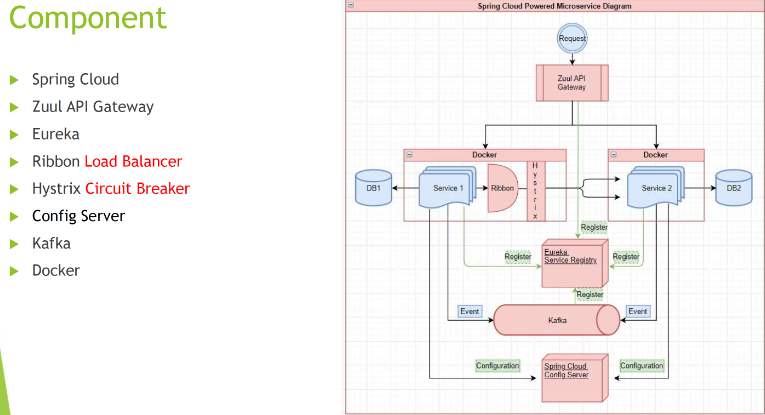

# Homework 14
## 2. Document the microservice architeture and components/tools/dependencies

API gateway: route request to the corrsponding services;

Eureka: service registry, monitor service health, auto-register new services, service discovery

How to communicate between services: use restTemplate

Load balancing: enables the service to scale well and stay high availability when the traffic load increases.

circuit breaker: a server calls b and b has a problem, circuit breaker can catch the problem and process a fallback plan.

Configuration: spring cloud offers support for Consul as a server for configurations. We can use applications.properties.

Kafka: can be used for communication between services. It can decouple the data streams and systems.

## 3. What are resilience pattern? What is circuit breaker?
Resilience pattern are design principles and techniques used to build robust and resilient software that can handle failures and disrupts;

Retry: Retry pattern involves automatically retrying a failed operation with the hope that it will succeed on subsequent attempts. It allows for transient failures to be overcome without manual intervention.

Circuit Breaker: Circuit Breaker pattern is used to prevent a system from continuously executing a failing operation. It monitors the availability of a service and, if the failure rate exceeds a certain threshold, the circuit breaker trips, blocking subsequent requests and providing fallback responses.

Bulkhead: Bulkhead pattern is about dividing the system into isolated compartments (or "bulkheads") to limit the impact of failures. If one component fails, it does not bring down the entire system but only affects a specific portion.

Timeout: Timeout pattern involves setting a maximum time for an operation to complete. If the operation exceeds the defined time limit, it is considered failed or abandoned. Timeouts prevent requests from waiting indefinitely and help maintain system responsiveness.

Fallback: Fallback pattern defines an alternative response or behavior when an operation fails. It allows the system to gracefully handle failures by providing a backup plan or default behavior.

Circuit Breaking: Circuit Breaking pattern is similar to the Circuit Breaker pattern but focuses on detecting and breaking communication with external services or dependencies that are experiencing issues. It helps prevent cascading failures by isolating the failing service.

Retry with Backoff: Retry with Backoff pattern introduces a delay between retry attempts, gradually increasing the delay with subsequent retries. It helps avoid overloading the system and reduces the chances of immediate consecutive failures.

Time out: a time out prevents a microservice from waiting too long for another microservice;

Circuit breaker: if a system call results in an error, the circuit breaker is opened and does not allow any calls to pass through.

## 4. Read this article, then list the important questions, then write your answers

## 5. how to do load balance in microservice? Write a long Summary by yourself.

## 6. How to do service discovery?
Use Eureka server, it help to register service, check the heartbeat. For sychronous coomunication, microservices have to find out at which port or IP  address other microservices can be accessed.

## 7. What are the major components of Kafka?
Producers: send data to kafka;

Brokers: server, can have different topics and its corresponding partitions;

CLuster: several brokers;

Consumers: get data from kafka;

Topics: Topics are the fundamental units of data organization in Kafka. They represent the streams of records or messages that are published and consumed by producers and consumers, respectively. Topics are partitioned and can be replicated across multiple brokers for fault tolerance.

Producers: Producers are responsible for publishing messages to Kafka topics. They write data to topics and can choose to specify the target partition or rely on Kafka's partitioning strategy. Producers can also set message keys for message ordering and facilitate efficient data distribution.

Consumers: Consumers read and process messages from Kafka topics. They subscribe to one or more topics and consume messages from the assigned partitions. Consumers can be part of a consumer group, where each consumer in the group processes a subset of partitions for parallel processing.

Brokers: Brokers are the Kafka servers that form the distributed cluster. They store and manage the published messages in topics, handle consumer requests for messages, and replicate data across brokers for fault tolerance. Brokers are responsible for the storage, retrieval, and replication of Kafka data.

ZooKeeper: ZooKeeper is a centralized coordination service used by Kafka for cluster management, leader election, and maintaining metadata. It tracks the status of brokers, topics, partitions, and consumer groups. Starting from Apache Kafka 2.8.0, ZooKeeper is no longer required, and Kafka uses its internal metadata quorum for coordination.

## 8. What do you mean by a Partition in Kafka?
A partition is a fundamental unit of a topic, each data from the same topic with the same hashcode of the key can be put into the same partition. 

Each partition is hosted on a specific broker and multiple replicas store in other broker. 

1. Ordering: the order is maintained in each partition, the one with lower offsets will be consumed before higher offsets
2. Scalability, fault tolerance: several replicas allows multiple read;
3. Data retention: Each partition has its own configurable retention period, specifying how long the messages within the partition should be retained. Once the retention period is exceeded, older messages are eligible for deletion.
