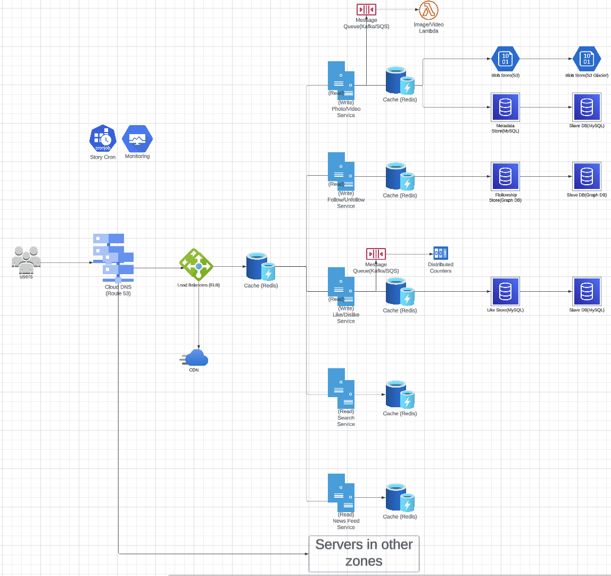
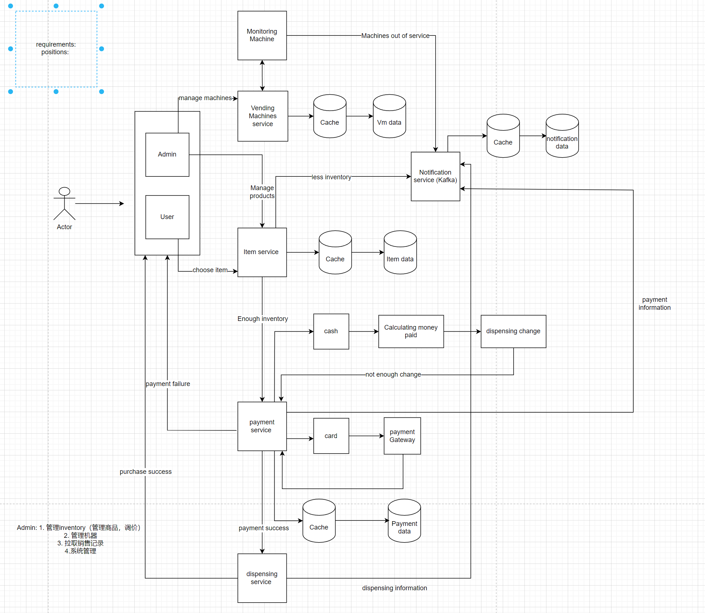
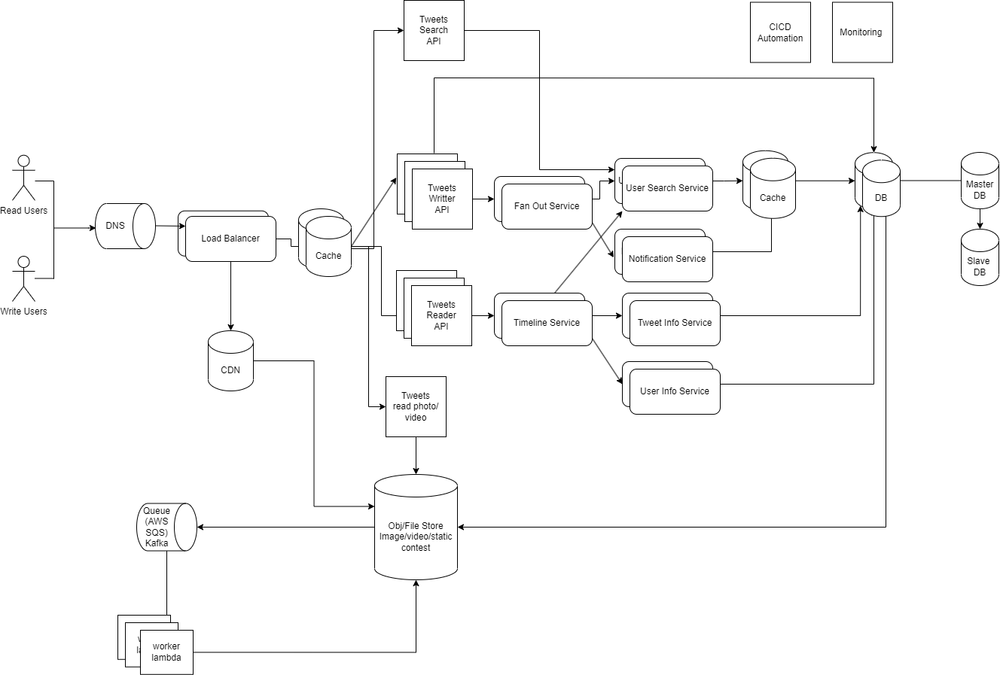

## System design: Instagram

In Instagram, if certain posts have extremely large likes and views, **sharding** can be used to distribute the data across multiple database servers and handle the increased load. Sharding involves partitioning the data based on a specific criterion and storing each partition on a separate database server.
1. Identify Sharding Criterion: Start by determining the criterion you'll use to partition the data. For instance, you can consider using the post ID or user ID as the sharding key. By utilizing the post ID, you'll ensure an even distribution of the load across multiple servers while maintaining data locality for each post.
2. Sharding Strategy: Choose an appropriate sharding strategy that aligns with the identified sharding criterion. A commonly employed technique is range-based sharding, where you divide the range of post IDs or user IDs into equal or proportional partitions. For example, you can assign posts with IDs from 1 to 100,000 to one server, IDs from 100,001 to 200,000 to another server, and so on. This strategy facilitates efficient data distribution and management across the shards.
3. Load Balancing: To evenly distribute read and write requests across the shards, it's essential to incorporate a load balancer into the system. The load balancer acts as the traffic controller, routing requests to the appropriate shard based on the sharding key. By implementing load balancing, you can ensure that the workload is evenly distributed across the database servers, maximizing performance and scalability.

## System design: Vending Machine

 Consider designing the database architecture to include a master database (master DB) and a slave database (slave DB). The master DB handles write operations, while the slave DB is responsible for read operations.

## System design: Twitter

You can identify what database you use in the system design. For instance, you could use a relational database for storing user information, tweets, and metadata, while employing a NoSQL database for storing user timelines, follower/following relationships, and other highly scalable data.
