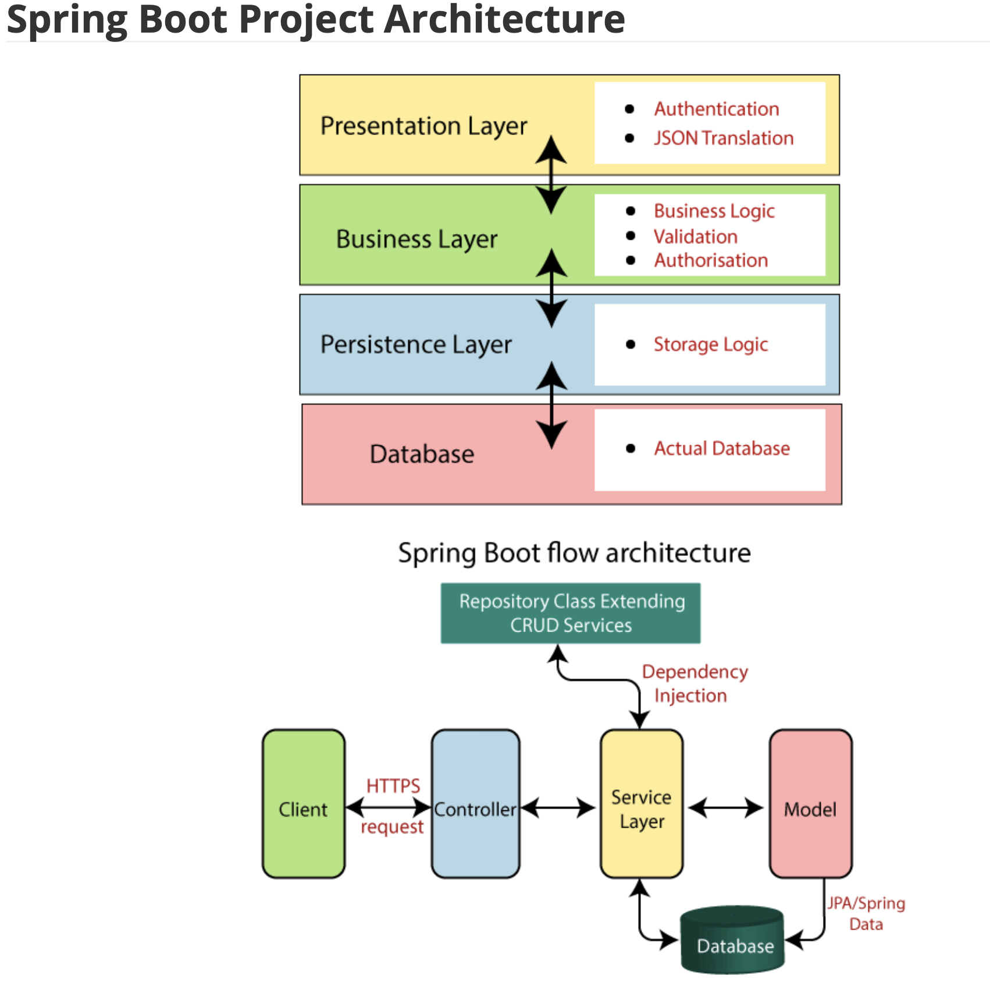
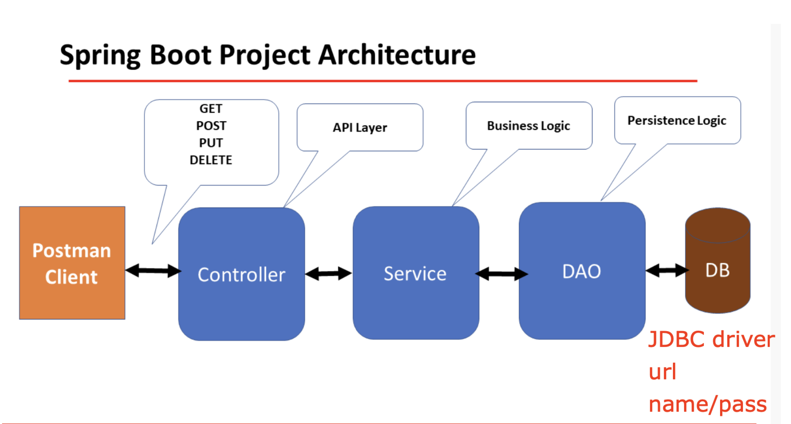

# 1. create a file to list all of the annotations you learned and known,and explain the usage and how do you understand it.you need to update it when you learn a new annotation. Please organize those annotations well, like annotations used by entity, annotations used by controller.
please find in `ShortQuestions/annotations.md`

# 2.explain how the below annotations specify the table in database?
```
@Column(columnDefinition = "varchar(255) default 'John Snow'")
private String name;
@Column(name="STUDENT_NAME", length=50, nullable=false, unique=false)
private String studentName;
```
The `@Column` annotation is used to point to a Java object's field to a column in a database table.
In first line, it specifies that the column is of type varchar(255) and has a default value of 'John Snow'
In the second line, the name of the column in the database table is `"STUDENT_NAME"`
The maximum length of the column's value is 50. 
The nullable attribute is used to specify whether the column can be null or not. 
The unique attribute is used to specify whether the column's value must be unique across all rows in the table.

# 3. What is the default column names of the table in database for @Column?
```
@Column
private String firstName;
@Column
private String operatingSystem;
```
In the given examples, the default column names in the database table would be `firstName` and `operatingSystem`.

# 4. What are the layers in spring boot application?what is the role of each layer?


# 5. Describe the flow in all of the layers if an API is called by Postman.
Postman client <-> Controller <-> Service <-> DAO <-> DB


# 6. What is the application.properties?do you know application.yml?
- `application.properties` is a file used in Spring Boot applications to configure various properties such as database settings, logging, server port, etc. 
It's a plain text file that contains key-value pairs, where each key-value pair represents a configuration property.

For example:
```
server.port=8080
# datasource
spring.datasource.url = jdbc:mysql://localhost:3306/redbook?
useSSL=false&serverTimezone=UTC
spring.datasource.username= springstudent
spring.datasource.password= springstudent
# hibernate properties
spring.jpa.properties.hibernate.dialect = org.hibernate.dialect.MySQL5Dialect
# hibernate ddl auto(create, create-drop, validate, update)
spring.jpa.hibernate.ddl-auto = update
```

- `application.yml` is an alternative to application.properties that uses YAML syntax instead of plain text. 
It's a hierarchical structure that allows for more complex configurations to be specified in a more readable format. 

For example:
```
server:
  port: 8080

spring:
  datasource:
    url: jdbc:mysql://localhost:3306/mydb
    username: root
    password: password
```

# 7. 

# 8. 