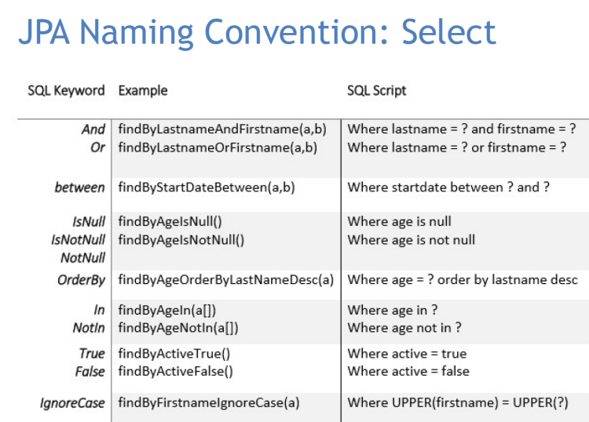

## 1. List all the annotations you learned from class and homework to annotations.md.  
Please check `ShortQuestions/annotations.md`.

## 2. Type the Comment feature for the class project.  
   Please check `MavenProject/redbook`.

## 3. In postman, call APIs in PostController and CommentController.
Please check `ShortQuestions/redbook.postman_collection.json`.

## 4. What is JPA? and what is Hibernate?
* **JPA** (Java Persistence API) is a specification for Object-Relational Mapping (ORM) frameworks in Java. It defines a set of interfaces and annotations for mapping Java objects to relational database tables and vice versa. JPA allows developers to use a high-level object-oriented programming model to interact with the database instead of using low-level SQL statements.

* **Hibernate** is an open-source, Java-based ORM framework. It provides a high-level abstraction over traditional JDBC-based database interactions, allowing developers to work with Java objects instead of raw SQL queries. Hibernate implements the JPA specification, providing an implementation for the interfaces and annotations defined by the JPA.

## 5. What is Hikari? what is the benefits of connection pool?
**Hikari** is a high-performance JDBC connection pool that provides a number of benefits over traditional connection pooling libraries. It is designed to be **lightweight and fast**, and has become a popular choice for connection pooling in many Java applications.

One of the main benefits of using a connection pool is that it allows applications to **reuse database connections** rather than creating a new connection each time a database operation is required. Creating new connections can be an expensive operation, particularly if the database is remote, so connection pooling can significantly reduce the overhead associated with establishing new connections.

Connection pooling also allows for **more efficient use of database resources**. By limiting the number of active connections, the pool can prevent the database from becoming overloaded with connections, which can lead to performance problems or even database crashes.

## 6. What is the @OneToMany, @ManyToOne, @ManyToMany? write some examples.
1. @OneToMany  

`@OneToMany` is a JPA annotation used to specify a one-to-many relationship between two entities. It is used to associate multiple instances of an entity with a single instance of another entity. In other words, it defines a parent-child relationship between two entities, where the parent entity has a collection of child entities.

For example, consider two entities, `Order` and `OrderItem`, where an order can have multiple items. The `Order` entity would have a collection of `OrderItem` entities defined with the @OneToMany annotation. This tells JPA that each instance of `Order` can be associated with multiple instances of `OrderItem`.

```java
@Entity
public class Order {
    // ...
    @OneToMany(mappedBy = "order")
    private List<OrderItem> items = new ArrayList<>();
    // getters and setters
}

@Entity
public class OrderItem {
    // ...
    @ManyToOne
    private Order order;
    // getters and setters
}
```
2. @ManyToOne  

`@ManyToOne` is a JPA annotation used to define a many-to-one relationship between two entities in a relational database. It is used to define a foreign key constraint between two tables where one table has multiple instances of another table's primary key value.

The `@ManyToOne` annotation is placed on the field or property in the dependent entity that represents the relationship to the parent entity. It requires a `@JoinColumn` annotation to specify the column in the dependent table that references the primary key column in the parent table.
```java
@Entity
public class Product {
    // ...
    @ManyToOne
    @JoinColumn(name = "category_id")
    private Category category;
    // ...
}

@Entity
public class Category {
    // ...
    @OneToMany(mappedBy = "category")
    private List<Product> products;
    // ...
}
```
In this example, the `Product` entity has a many-to-one relationship with the `Category` entity. The `category` field in the `Product` entity is annotated with `@ManyToOne` to specify the relationship, and the `category_id` column in the `product` table is used as the foreign key to the `id` column in the `category` table. The `Category` entity has a one-to-many relationship with the `Product` entity, which is mapped by the `products` field.

3. @ManyToMany  

`@ManyToMany` is a JPA annotation used to specify a many-to-many relationship between two entities. It indicates that each entity instance of the source type (annotated entity) can be associated with multiple instances of the target type (another annotated entity), and vice versa.

For example, consider a scenario where you have two entities `Book` and `Author`. An author can write multiple books, and a book can have multiple authors. In this case, you can use the `@ManyToMany` annotation to specify the relationship between the two entities.

```java
@Entity
public class Book {
    
    @Id
    @GeneratedValue(strategy = GenerationType.IDENTITY)
    private Long id;

    @ManyToMany
    private Set<Author> authors;

    // other fields and methods
}

@Entity
public class Author {
    
    @Id
    @GeneratedValue(strategy = GenerationType.IDENTITY)
    private Long id;

    @ManyToMany(mappedBy = "authors")
    private Set<Book> books;

    // other fields and methods
}
```

## 7. What is the `cascade = CascadeType.ALL, orphanRemoval = true`? and what are the other CascadeType and their features? In which situation we choose which one?
Cascading means propagating an operation from the owning entity to the related entity. When a record in the owning entity (parent table) is saved, updated or deleted, the change should be reflected in the related entity (child table) as well.

The `CascadeType.ALL` value means that all the cascade operations (i.e. persist, remove, refresh, merge, and detach) should be applied to the related entities when the owning entity is operated on. The `orphanRemoval = true` means that when a related entity is removed from the collection or the relationship to the owning entity is broken, it should be deleted from the database.

- `CascadeType.PERSIST`: Specifies that the persist operation should be cascaded to the related entities.
- `CascadeType.MERGE`: Specifies that the merge operation should be cascaded to the related entities.
- `CascadeType.REMOVE`: Specifies that the remove operation should be cascaded to the related entities.
- `CascadeType.REFRESH`: Specifies that the refresh operation should be cascaded to the related entities.
- `CascadeType.DETACH`: Specifies that the detach operation should be cascaded to the related entities.

* For a one-to-one relationship, you can use `CascadeType.ALL` or `CascadeType.PERSIST`, depending on whether you want the associated entity to be deleted along with the owning entity.
* For a one-to-many or many-to-one relationship, you can use `CascadeType.ALL` or `CascadeType.PERSIST`, depending on whether you want the associated entities to be deleted along with the owning entity.
* For a many-to-many relationship, you typically don't want to use `CascadeType.REMOVE`, as this would delete both sides of the relationship. Instead, you can use `CascadeType.PERSIST` and/or `CascadeType.MERGE` as appropriate.

## 8. What is the fetch = FetchType.LAZY, fetch = FetchType.EAGER? what is the difference? In which situation you choose which one?
`FetchType`: There are two ways in which data is loaded: eager and lazy. Eager fetch means that when a record is fetched from the database, all the associated records from related tables are also fetched. So if we fetch a tournament record, all the registrations for the tournament are also fetched.

Eager fetch is the default fetch type used by Hibernate but it is not always the most efficient. Lazy fetch on the other hand, fetches the records only when they are needed.

`FetchType.Lazy`:
* If we don't need data from comment, JPA doesn't fetch it
* Only fetch data from post
* when we need data from comment, then JPA fetch comment data

`FetchType.Eager`
* when we fetch post, JPA also fetch comment at the same time.

## 9. What is the rule of JPA naming convention? Shall we implement the method by ourselves? Could you list some examples?
**JPA naming convention** follows a set of rules for naming the entities and their attributes, which allows JPA to map the entities to database tables and columns automatically. The naming convention is as follows:

1. Entity names should start with an uppercase letter.
2. Attribute names should start with a lowercase letter.
3. Entity names and attribute names should be in **camelCase**.
4. The entity name should match the table name in the database, and the attribute names should match the column names.

**JPA** provides default implementations for most of the methods, such as `findById()`, `findAll()`, `save()`, and `delete()`.
 

## 10. Try to use JPA advanced methods in your class project. In the repository layer, you need to use the naming convention to use the method provided by JPA.
Please check `com.chuwa.redbook.dao.PostRepository` in `MavenProject/redbook`


## 13. type the code, you need to check out new branch from branch 02_post_RUD, name the new branch with https://github.com/TAIsRich/springboot-redbook/tree/hw05_01_slides_JPQL.
Please check `MavenProject/redbook`

## 14. What is JPQL?
JPQL (Java Persistence Query Language) is a query language defined in the Java Persistence API (JPA) for accessing and manipulating objects in a relational database. It is a platform-independent, object-oriented query language that is similar to SQL but uses object and entity references instead of table and column names. JPQL is used to perform database operations on entities, which are objects mapped to database tables using JPA annotations. JPQL provides a way to query entities based on their attributes, relationships, and other criteria. It allows developers to write database queries using an object-oriented syntax, which makes it easier to write and maintain complex queries.

## 15. What are @NamedQuery and @NamedQueries?
`@NamedQuery` and `@NamedQueries` are annotations in JPA that allow developers to define named queries in the entity class. Named queries are JPQL queries that are assigned a name and can be called by name in the code.

`@NamedQuery` is used to define a single named query in an entity class. It takes two parameters: the name of the query and the JPQL query string.
```java
@Entity
@NamedQuery(name = "findAllPosts", query = "SELECT p FROM Post p")
public class Post {
   ...
}
```
`@NamedQueries` is used to define multiple named queries in an entity class. It takes an array of @NamedQuery annotations as a parameter.
```java
@Entity
@NamedQueries({
   @NamedQuery(name = "findAllPosts", query = "SELECT p FROM Post p"),
   @NamedQuery(name = "findPostById", query = "SELECT p FROM Post p WHERE p.id = :id")
})
public class Post {
   ...
}
```

## 16. What is @Query? In which Interface we write the sql or JPQL?
In JPA, the `@Query` annotation is used to define custom `SQL` or `JPQL` (Java Persistence Query Language) queries. It allows developers to write `SQL` or `JPQL` statements and map the results to JPA entities.

The `@Query` annotation can be used in the repository layer, which is an interface extending JpaRepository or CrudRepository. The interface can define the method signature with the `@Query` annotation and the custom SQL or JPQL query string. The @Query annotation can also be used with named parameters or positional parameters.
```java
@Query("SELECT p FROM Post p WHERE p.title = :title")
List<Post> findByTitle(@Param("title") String title);
```

## 17. What is HQL and Criteria Queries?
HQL stands for Hibernate Query Language, which is a language for executing database queries in Hibernate, a popular ORM framework for Java. HQL is very similar to JPQL (Java Persistence Query Language), but it also supports some additional features provided by Hibernate.

HQL is a powerful query language that can be used to perform complex database queries. It supports a variety of features such as subqueries, joins, group by, order by, and more. HQL queries can be executed using the Hibernate Query API, which provides a set of methods for executing HQL queries.

Criteria Queries provide an alternative way to write database queries in Hibernate. Instead of writing queries as strings, Criteria Queries use a type-safe API to define queries programmatically. This approach has the advantage of being more robust, as it can detect syntax errors at compile time, rather than at runtime.

## 18. What is EntityManager?
EntityManager is an interface in JPA (Java Persistence API) that provides a set of methods for managing entity objects, which are Java objects that represent data stored in a relational database. EntityManager is responsible for the lifecycle of entity objects, including **creating, reading, updating, and deleting** them from the database. It acts as a bridge between the Java application and the database, and provides a way for developers to interact with the database using high-level object-oriented programming techniques rather than writing low-level SQL statements. EntityManager also provides caching and transaction management features to ensure data consistency and performance.
```java
public void deleteById(Long id) {
    Post post = entityManager.find(Post.class, id);
    entityManager.remove(post);
}
```

## 19. What is SessionFactory and Session?
**SessionFactory** is a factory for creating Session objects, and it is responsible for managing the lifecycle of these objects. It is typically created once at the beginning of an application and shared among different threads.

**Session** represents a single unit of work with the database. It is obtained from a SessionFactory and provides methods for persisting, retrieving, and deleting objects from the database.

In short, SessionFactory is a factory for creating Session objects, while Session represents a single database connection with a specific transaction.

## 20. What is Transaction? how to manage your transaction?
A transaction is a series of database operations that must be performed as a single unit of work. A transaction ensures that either all the operations succeed, or none of them do. This guarantees data consistency and integrity.

In the JPA and Hibernate frameworks, transactions are managed through the EntityManager or Session objects. To start a transaction, you need to call the `beginTransaction()` method on the EntityManager or Session object. Once you have started a transaction, you can perform a series of database operations, such as inserts, updates, and deletes. After you have completed the operations, you can commit the transaction by calling the `commit()` method. If any of the operations fail, you can roll back the transaction by calling the `rollback()` method.

```java
void testSessionFactory() {
    // 1. 根据配置⽂件，创建⼀个sessionFactory
    SessionFactory sessionFactory = new
    Configuration().configure("hibernate.cfg.xml").buildSessionFactory();
    // 2. sessionFactory 创建出⼀个session
    Session session = sessionFactory.openSession();
    Transaction transaction = null;
    try {
        // 3. session 开始⼀个transaction
        transaction = session.beginTransaction();
        // 4. 执⾏txn
        post.setTitle(post.getTitle() + LocalDateTime.now());
        post.setCreateDateTime(LocalDateTime.now());
        post.setUpdateDateTime(LocalDateTime.now());
        Post savedPost = (Post) session.merge(post);
        System.out.println(savedPost);
        // 5. commit txn, 该txn要么成功，要么失败,是个原⼦操作。
        transaction.commit();
    } catch (Exception e) {
        if (transaction != null) {
            // txn 失败则回滚
            transaction.rollback();
        }
        e.printStackTrace();
    } finally {
        // 6. close session
        session.close();
    }
}
```

## 21. What is Hibernate Caching?
Hibernate caching is a mechanism for improving application performance by reducing the number of times an application needs to access the database. It involves storing frequently accessed data in a cache, which is a temporary storage area that can be quickly accessed. When the application requests data that is stored in the cache, Hibernate returns the data from the cache instead of querying the database. This can significantly reduce the time it takes to access data and improve application performance.


## 22. What is the difference between first-level cache and second-level cache?
* First-level cache
  Hibernate first level cache is session specific, that’s why when we are getting the same data in same session there is no query fired whereas in other session query is fired to load the data.
* Second-level cache : When an entity instance is looked up by its id and if second-level caching is enabled for that entity, the following happens:
    * a. If an instance is already present in the first-level cache, it is returned from there
    * b. If an instance is not found in the first-level cache, and the corresponding instance state is cached in the second-level cache, then the data is fetched from there and an instance is assembled and returned
    * c. Otherwise, the necessary data are loaded from the database and an instance is assembled and returned

|**FIRST LEVEL CACHE**   |**SECOND LEVEL CACHE**   |
|---|---|
|This is local to the Session object and cannot be shared between multiple sessions.   | This cache is maintained at the SessionFactory level and shared among all sessions in Hibernate.  |
| This cache is enabled by default and there is no way to disable it.  |This is disabled by default, but we can enable it through configuration.   |
| The first level cache is available only until the session is open, once the session is closed, the first level cache is destroyed.  | The second-level cache is available through the application’s life cycle, it is only destroyed and recreated when an application is restarted.  |


## 23. How do you understand @Transactional? 
https://github.com/TAIsRich/tutorial-transaction

Please check `MavenProject/tutorial-transaction`.

## 24. Write a simple factory design pattern
```java
public interface Animal {
    void speak();
}

public class Dog implements Animal {
    @Override
    public void speak() {
        System.out.println("Woof!");
    }
}

public class Cat implements Animal {
    @Override
    public void speak() {
        System.out.println("Meow!");
    }
}

public class AnimalFactory {
    public Animal createAnimal(String type) {
        switch (type) {
            case "dog":
                return new Dog();
            case "cat":
                return new Cat();
            default:
                throw new IllegalArgumentException("Invalid animal type: " + type);
        }
    }
}

public class Main {
    public static void main(String[] args) {
        AnimalFactory animalFactory = new AnimalFactory();
        Animal dog = animalFactory.createAnimal("dog");
        Animal cat = animalFactory.createAnimal("cat");
        dog.speak(); // Output: Woof!
        cat.speak(); // Output: Meow!
    }
}
```