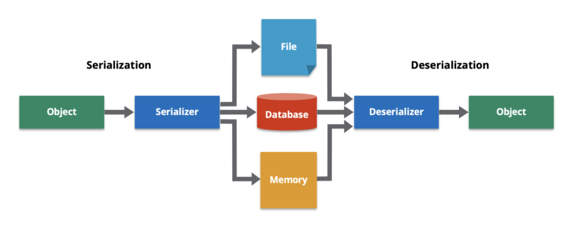

# HW7
## 1. List all of the new annotations to your annotations.md and explain its role.
## 2. How do you do the debug?
1. **Set breakpoints**: Place breakpoints in your code by clicking on the left-hand gutter of the editor window at the line where you want to pause the program's execution.
2. **Run in debug mode**: Start your application in debug mode by clicking on the "Debug" button or selecting "Debug" from the Run menu. This will launch your application and attach the debugger to it.
3. **Debugging tools**: Once your application is running in debug mode, you can use various debugging tools provided by IntelliJ IDEA, such as the Debug tool window, the Debugger tab, and the Debug Console. These tools allow you to inspect variables, view call stacks, step through code, and modify variables during runtime.
4. **Breakpoint hit**: When a breakpoint is hit during the execution of your program, the program will pause, and the debugger will highlight the line where the breakpoint is set. You can then use the debugging tools to inspect the program's state and step through the code to understand its behavior.
5. **Resume execution**: You can resume the execution of your program by clicking on the "Resume Program" button or selecting "Resume" from the Run menu. This will continue the program's execution until the next breakpoint is hit or the program completes.
6. **Inspect variables**: While debugging, you can inspect the values of variables by hovering over them or using the Variables tab in the Debug tool window. You can also modify variable values during runtime to test different scenarios.
7. **Step through code**: You can step through your code using the "Step Over" (F8), "Step Into" (F7), and "Step Out" (Shift + F8) buttons or the corresponding options in the Run menu. These allow you to move through your code line by line and understand how it is executed.
8. **Debugging settings**: IntelliJ IDEA also provides various debugging settings, such as conditional breakpoints, exception breakpoints, and watchpoints, which allow you to customize the debugging behavior according to your needs.
9. **Stop debugging**: You can stop the debugging session by clicking on the "Stop" button or selecting "Stop" from the Run menu. This will terminate your program and end the debugging session.

## 3. What is DTO, VO, Payload, DO, model?
1. **DTO (Data Transfer Object)**: DTOs are often used to **encapsulate data** that needs to be passed between different layers of an application, such as from the front-end to the back-end or between different microservices. DTOs are typically simple Java classes that only contain fields for data and do not have any business logic.

2. **VO (Value Object)**: VO is another design pattern used to represent immutable objects that encapsulate a group of related values or properties. In Spring Boot, VOs are often used to represent domain-specific values or properties that are used within a particular context. VOs are typically used to represent **read-only** data that does not change during the lifecycle of an object.

3. **Payload**:Payload often refers to the data that is **sent or received in HTTP requests or responses**. Payloads can be in various formats, such as JSON, XML, or binary data, and they are typically processed and transformed by the application to extract or send data.

4. **DO (Domain Object)**: DO refers to the objects that represent the domain model or business logic of an application. In Spring Boot, DOs are typically used to represent the business entities or concepts in the application's domain. DOs encapsulate the behavior and state of the business objects and are often used to perform operations and enforce business rules.

5. **Model**: Model is a general term used to refer to the representation of data or objects in an application. In Spring Boot, the term "model" can refer to different types of objects depending on the context. It can refer to the objects used in the Model-View-Controller (MVC) architectural pattern, where the **model represents the data or business objects**, the view represents the user interface, and the controller handles user input and updates the model. It can also refer to data objects used for data modeling, such as database entities or data transfer objects.

## 4. What is @JsonProperty("description_yyds")?
`@JsonProperty` is a Jackson annotation in Java that is used to specify the mapping between a Java object property and a JSON field during serialization and deserialization.
```java
public class Product {
    @JsonProperty("description_yyds")
    private String description;

    // other properties and methods
}
```
In this example, the `description` property of the `Product` class is annotated with `@JsonProperty("description_yyds")`. This means that during serialization, the property `description` will be mapped to the JSON field `description_yyds`, and during deserialization, the JSON field `description_yyds` will be mapped to the property `description`. This allows you to customize the naming of JSON fields in the serialized and deserialized JSON representations of the `Product` class.

## 5. Do you know what is jackson?
```xml
<dependency>
    <groupId>com.fasterxml.jackson.core</groupId>
    <artifactId>jackson-databind</artifactId>
    <version>2.13.3</version>
    <scope>compile</scope>
</dependency>
```

Jackson is a Java library for JSON processing. It provides a set of APIs for converting Java objects to JSON (serialization) and JSON to Java objects (deserialization).

Jackson supports various data binding modes, including:
1. Streaming API: Allows reading and writing JSON as a stream of tokens, which is useful for processing large JSON documents efficiently.
2. Tree Model: Represents JSON as a tree of objects, which allows for easy manipulation and traversal of the JSON structure.
3. Data Binding: Provides automatic mapping between Java objects and JSON, allowing for easy conversion between Java objects and JSON representations.

Serializing Java Object to JSON:
```java
import com.fasterxml.jackson.databind.ObjectMapper;

public class MyObject {
    private String name;
    private int age;
    // ... other fields, constructors, getters, and setters
}

public class MyService {
    public String convertToJson(MyObject myObject) throws JsonProcessingException {
        ObjectMapper objectMapper = new ObjectMapper();
        String jsonString = objectMapper.writeValueAsString(myObject);
        return jsonString;
    }
}
```

Deserializing JSON to Java Object:
```java
import com.fasterxml.jackson.databind.ObjectMapper;

public class MyObject {
    private String name;
    private int age;
    // ... other fields, constructors, getters, and setters
}

public class MyService {
    public MyObject convertToJavaObject(String jsonString) throws JsonProcessingException {
        ObjectMapper objectMapper = new ObjectMapper();
        MyObject myObject = objectMapper.readValue(jsonString, MyObject.class);
        return myObject;
    }
}
```

## 6. What is spring-boot-stater?
Starter is a **pre-configured package or module** that provides a collection of dependencies that are commonly used together to enable specific features or functionality in a Spring Boot application. 

Starters are designed to simplify the process of configuring dependencies in a Spring Boot application by providing a single, easy-to-use dependency that includes all the necessary dependencies for a specific feature or functionality.

A starter typically includes the necessary libraries, configurations, and dependencies for a specific use case or feature, such as a web application, data access, security, testing, logging, etc. Starters are managed by the Spring Boot team and are published as Maven artifacts, which can be easily included as dependencies in your Spring Boot project.

a. what dependencies in the below starter? do you know any starters?
```xml
<dependency>
    <groupId>org.springframework.boot</groupId>
    <artifactId>spring-boot-starter-web</artifactId>
</dependency>
```
1. `spring-boot-starter-web` is a commonly used starter in Spring Boot applications for building web-based applications or APIs.
2. `spring-boot-starter`: This is the core Spring Boot starter, which provides the basic functionalities and configurations required for a Spring Boot application.
3. `spring-boot-starter-web`: This includes the necessary dependencies for building web-based applications, such as Spring MVC, embedded web server (Tomcat, Jetty, or Undertow), and other web-related libraries.
4. `spring-boot-starter-json`: This includes the Jackson library for JSON (de)serialization, which is commonly used in web applications for handling JSON data.
5. `spring-boot-starter-tomcat` or `spring-boot-starter-jetty` or `spring-boot-starter-undertow`: This includes the embedded web server library that will be used to run the application. You can choose one of them based on your preference or requirement.

## 7. Do you know `@RequestMapping(value = "/users", method = RequestMethod.POST)`? could you list CRUD by this style?
`@RequestMapping(value = "/users", method = RequestMethod.POST)` is a Spring MVC annotation used to map HTTP requests to a specific controller method.

1. Create a new user (POST):
```java
@RequestMapping(value = "/users", method = RequestMethod.POST)
```
2. Get a user by ID (GET): 
```java
@RequestMapping(value = "/users/{id}", method = RequestMethod.GET)
```
3. Update a user by ID (PUT): 
```java
@RequestMapping(value = "/users/{id}", method = RequestMethod.PUT)
```
4. Delete a user by ID (DELETE):
```java
@RequestMapping(value = "/users/{id}", method = RequestMethod.DELETE)
```

## 8. What is ResponseEntity? why do we need it?
```java
new ResponseEntity<>(postResponse, HttpStatus.OK);
new ResponseEntity<>(postResponse, HttpStatus.CREATED);
ResponseEntity.ok(postService.getPostById(id));
```
ResponseEntity is a Spring class that represents an HTTP response, including the status code, headers, and body. It is commonly used in Spring applications to return a response from a controller method.

We need ResponseEntity when we want to customize the HTTP response, for example, to set a specific status code or add headers to the response. It allows us to create a more specific and customized response for the client.

* `new ResponseEntity<>(postResponse, HttpStatus.OK);` creates an HTTP response with a body of `postResponse` and a status code of 200 OK.
* `new ResponseEntity<>(postResponse, HttpStatus.CREATED);` creates an HTTP response with a body of `postResponse` and a status code of 201 CREATED.
* `ResponseEntity.ok(postService.getPostById(id));` creates an HTTP response with a body returned from the `getPostById` method and a status code of 200 OK.

## 9. What is ResultSet in jdbc? and describe the flow how to get data using JDBC
ResultSet is an interface in JDBC that provides methods for retrieving data from a database query. It represents a table of data that is generated when a database query is executed.

1. **Load driver**: The first step is to load the JDBC driver using the `Class.forName()` method. This step is only required for older versions of JDBC. In modern JDBC versions, the driver is loaded automatically.
2. **Connect to Database**: The next step is to establish a connection to the database using the `DriverManager.getConnection()` method. The method takes a `URL`, `username`, and `password` as parameters.
3. **Define sql statement**: Define the SQL statement that we want to execute.
4. **Create a statement object**: Once the connection is established, create a Statement object using the `createStatement()` method. The Statement object is used to execute SQL queries.
5. `Use statement object to execute sql statement`: Execute the query by calling the `executeQuery()` method on the Statement object. The method returns a ResultSet object containing the results of the query.
6. `Get and process the ResultSet`: The ResultSet object provides methods for navigating through the rows and columns of the result set. You can use the `next()` method to move to the next row, and the `getXXX()` methods to retrieve the values of the columns.
7. `Close the ResultSet, Statement, and Connection`: After you have finished processing the ResultSet, you should close it, along with the Statement and Connection objects, in reverse order of creation.

## 10. What is the ORM framework?
**ORM** stands for **Object-Relational Mapping**. It is a programming technique that **maps object-oriented programming language constructs to relational database constructs**. ORM frameworks provide an abstraction layer between the application and the database, allowing developers to work with high-level object-oriented concepts, while the framework automatically maps these concepts to the underlying relational database. This helps to reduce the amount of boilerplate code required to work with databases, making it easier and faster to develop database-driven applications. 

Popular ORM frameworks in the Java ecosystem include **Hibernate**, **MyBatis**, and **Spring Data JPA**.

## 11. Learn how to use ObjectMapper by this example.
a. https://github.com/TAIsRich/chuwa-eij-tutorial/blob/main/02-java-core/src/main/java/com/chuwa/exercise/oa/api/FoodOutletJackson.java
```java
FoodOutlet foodOutlet =
objectMapper.readValue(resBody, FoodOutlet.class);
String s =
objectMapper.writeValueAsString(foodOutlet);
objectMapper.readTree() // learn how to use it?
```
Please check `Coding/java_tutorial/exercise/oa/api`.


## 12. What is the serialization and deserialization?
a. https://hazelcast.com/glossary/serialization/

**Serialization** is the process of converting a data object—a combination of code and data represented within a region of data storage—into a series of bytes that saves the state of the object in an easily transmittable form.

**Deserialization** is to construct a data structure or object from a series of bytes



## 13. Use stream api to get the average of the array [20, 3, 78, 9, 6, 53, 73, 99, 24, 32].
```java
import java.util.Arrays;

public class Main {
    public static void main(String[] args) {
        int[] numbers = {20, 3, 78, 9, 6, 53, 73, 99, 24, 32};
        double average = Arrays.stream(numbers)
                .average()
                .orElse(Double.NaN);
        System.out.println("Average: " + average);
    }
}
```

#  14 post pageable & 15 comment
Please check `MavenProject/redbook`.

## 16. Try to write the CRUD api for a new application Cassandra-Blog
Please check `MavenProject/Cassandra-Blog`, but has bugs to test the api.